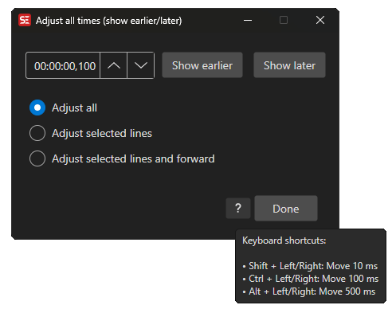

# Adjust All Times

Shift all subtitle timings by a fixed amount.

- **Menu:** Sync → Adjust all times...

<!-- Screenshot: Adjust all times window -->

## Options

- **Time offset** — Amount to shift (positive = later, negative = earlier)
- **Apply to** — All lines, selected lines only, or from/to a specific time
- **Both start and end** or just start/end time
