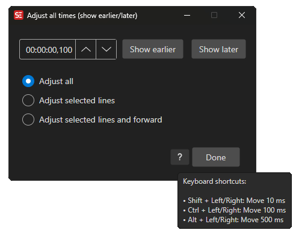

# Adjust All Times

Shift all subtitle timings by a fixed amount.

- **Menu:** Sync → Adjust all times...

<!-- Screenshot: Adjust all times window -->

## Options

- **Adjustment** — Time amount to shift
- **Show earlier** / **Show later** — Apply the adjustment as a negative or positive shift
- **Apply to** — All lines, selected lines only, or selected lines and forward

The window remembers its position and stays open across New/Open, so adjustments can be made while continuing to work on the subtitle.

## Keyboard shortcuts

- Shift/Ctrl/Alt + Left or Right arrow — Show earlier/later by 10/100/500 ms

> **Note:** "Selected lines and forward" applies the shift to the currently selected lines and every line after them.
