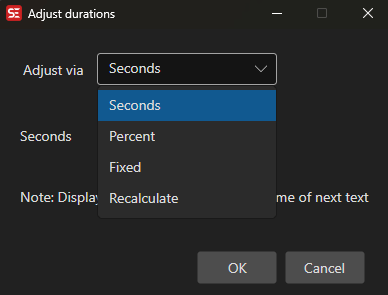

# Adjust Duration

Adjust the display duration of subtitle lines.

- **Menu:** Tools → Adjust durations...

<!-- Screenshot: Adjust duration window -->

## Options

- **Add/subtract seconds** — Adjust all durations by a fixed amount
- **Add/subtract percent** — Adjust durations by a percentage
- **Fixed duration** — Set all durations to a fixed value
- **Recalculate** — Recalculate durations based on text length and reading speed
