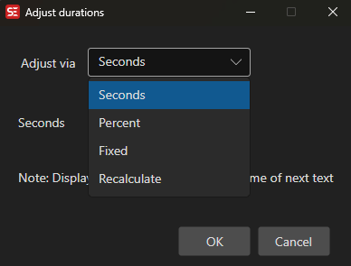

# Adjust Duration

Adjust the display duration of subtitle lines.

- **Menu:** Tools → Adjust durations...

<!-- Screenshot: Adjust duration window -->

## Options

- **Seconds** — Adjust all durations by a fixed number of seconds (positive or negative)
- **Percent** — Scale durations by a percentage
- **Fixed** — Set all durations to a fixed value (in seconds)
- **Recalculate** — Recalculate durations from text length using optimal and maximum characters/second
  - **Extend only** — Never shorten a subtitle, only extend it
