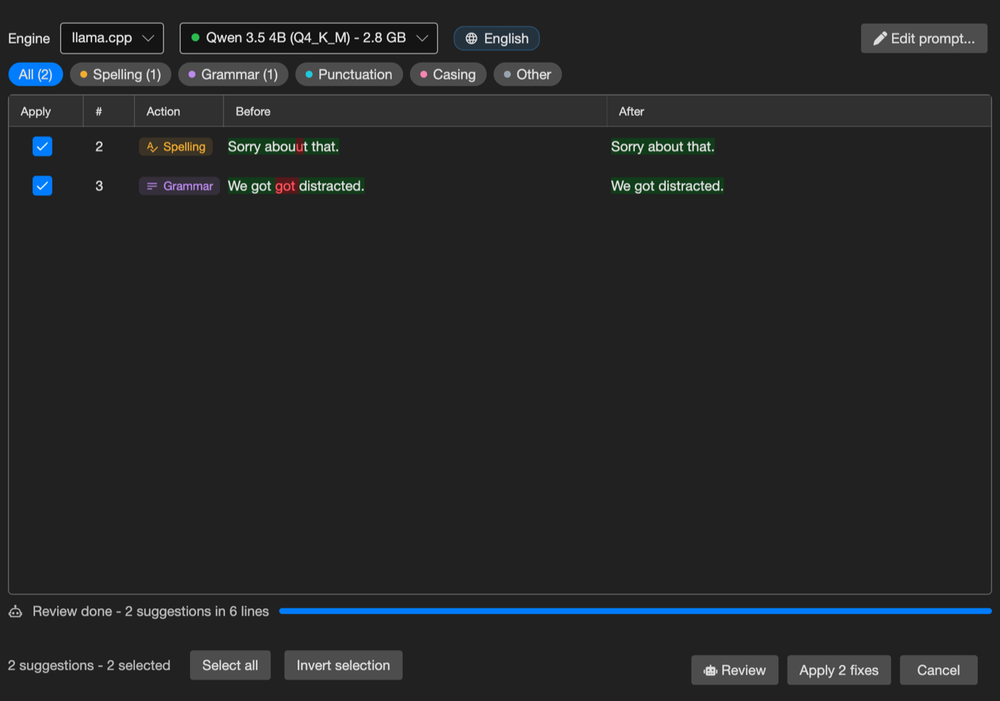

# AI Review

Proofread the subtitle text with a local (or remote) large language model - typos, spelling, grammar, punctuation and casing. Nothing is changed until you apply the suggestions you agree with.

- **Menu:** Tools → AI review...
- **Shortcut:** Ctrl+Alt+R (Cmd+Alt+R on macOS)

<!-- Screenshot: AI review window -->

## Engines

- **llama.cpp** — a managed local server. Pick a model from the curated list (Qwen 3.5, Gemma 3, Llama 3.1, EuroLLM, Phi-4 mini); Subtitle Edit downloads the engine and model on first use. A green dot marks models that are already downloaded. Custom `*.gguf` files placed in the llama.cpp models folder also appear.
- **Ollama** — uses a running [Ollama](https://ollama.com) instance; type a model name or pick one from the server.
- **OpenAI-compatible** — any endpoint that speaks the OpenAI chat API: LM Studio, KoboldCpp, vLLM, a llama.cpp server on another machine, or cloud APIs (OpenAI, Groq, OpenRouter, DeepSeek, Mistral, Gemini). Enter the URL, model name, and an API key if the service needs one.

## Reviewing

Press **Review** to start. The subtitle is sent to the model in small batches, and suggestions appear in the grid while the review runs - you can inspect, check and uncheck rows before it finishes, or press **Stop** to keep what was found so far.

Each suggestion shows:

- **Apply** — checkbox deciding whether the fix is applied
- **Line number** and a **category** tag (spelling, grammar, punctuation, casing, other)
- **Before / After** — with word-level differences highlighted
- Selecting a row shows the model's short **reason** below the grid

Filter the grid with the category chips above it. Press **Apply N fixes** to apply the checked suggestions - this is a single undo step (Ctrl+Z reverts everything).

## Sentences across multiple lines

Lines are grouped into sentence units, so a sentence that continues over several subtitles is always reviewed as a whole, and the model sees a couple of surrounding lines as read-only context. Corrections never move words between lines, so timing and reading speed are unaffected. Suggestions belonging to the same sentence are checked and unchecked together.

## The prompt

The **Edit prompt...** button opens the review instructions sent to the model. `{language}` is replaced with the auto-detected subtitle language. The strict data-exchange contract is appended by Subtitle Edit and cannot be broken by prompt edits, so feel free to tailor the instructions - e.g. "also flag anachronisms" or "never touch song lyrics".

## Safety rails

- Nothing is applied automatically - you decide per suggestion.
- Suggestions that would add or remove formatting tags are discarded.
- Suggestions that change a line's length a lot are flagged with a warning and start unchecked, since they are usually rewrites rather than corrections.
- Replies from the model that do not follow the expected format are retried once and then skipped.
