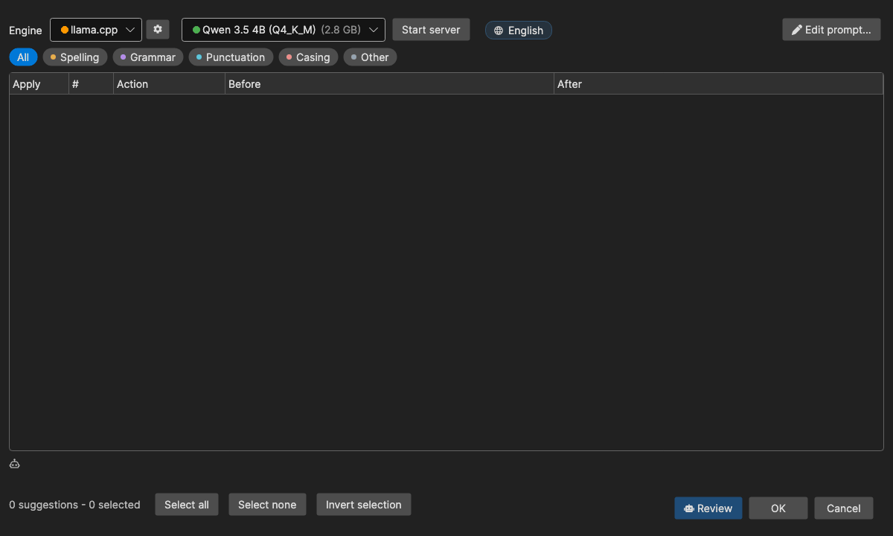

# AI Review

Proofread the subtitle text with a local (or remote) large language model - typos, spelling, grammar, punctuation and casing. Nothing is changed until you apply the suggestions you agree with.

- **Menu:** Tools → AI review...
- **Shortcut:** Ctrl+Alt+R (Cmd+Alt+R on macOS)

<!-- Screenshot: AI review window -->

## Engines

- **llama.cpp** — a managed local server. Pick a model from the curated list (Qwen 3.5, Gemma 3, Llama 3.1, EuroLLM, Phi-4 mini); Subtitle Edit downloads the engine and model on first use. A green dot marks models that are already downloaded. Custom `*.gguf` files placed in the llama.cpp models folder also appear.
- **Ollama** — uses a running [Ollama](https://ollama.com) instance; type a model name or pick one from the server.
- **OpenAI-compatible** — any endpoint that speaks the OpenAI chat API: LM Studio, KoboldCpp, vLLM, a llama.cpp server on another machine, or cloud APIs (OpenAI, Groq, OpenRouter, DeepSeek, Mistral, Gemini). Enter the URL, model name, and an API key if the service needs one.

### Using a cloud model

If a local model is too slow on your machine, select the **OpenAI-compatible** engine and point it at a cloud provider. Only the URL, model name and API key differ:

| Provider | URL | Example model |
|----------|-----|---------------|
| Google Gemini | `https://generativelanguage.googleapis.com/v1beta/openai/chat/completions` | `gemini-3.1-flash-lite` |
| OpenAI | `https://api.openai.com/v1/chat/completions` | `gpt-4o-mini` |
| DeepSeek | `https://api.deepseek.com/v1/chat/completions` | `deepseek-chat` |
| Groq | `https://api.groq.com/openai/v1/chat/completions` | `llama-3.3-70b-versatile` |
| Mistral | `https://api.mistral.ai/v1/chat/completions` | `mistral-small-latest` |
| OpenRouter | `https://openrouter.ai/api/v1/chat/completions` | `google/gemini-3.1-flash-lite` |
| LM Studio (local) | `http://localhost:1234/v1/chat/completions` | *name shown in LM Studio* |

The API key goes in the **API key** field - Subtitle Edit sends it as a bearer token.

The subtitle is sent in batches, and free tiers usually limit how many requests you may send per minute. The timer field after the API key sets a **delay in seconds between requests** - raise it if the provider starts rejecting requests. It is off (0) by default, and the first request of a review never waits.

Reviewing only part of a subtitle is also possible: select the lines in the subtitle grid, then right-click → **Selected lines** → **AI review...**.

## Reviewing

Press **Review** to start. The subtitle is sent to the model in small batches, and suggestions appear in the grid while the review runs - you can inspect, check and uncheck rows before it finishes, or press **Stop** to keep what was found so far.

Each suggestion shows:

- **Apply** — checkbox deciding whether the fix is applied
- **Line number** and a **category** tag (spelling, grammar, punctuation, casing, other)
- **Before / After** — with word-level differences highlighted
- Selecting a row shows the model's short **reason** below the grid

Filter the grid with the category chips above it. Press **Apply N fixes** to apply the checked suggestions - this is a single undo step (Ctrl+Z reverts everything).

**Apply does not close the window.** The applied rows disappear from the grid and everything else stays, so a review can be worked through in passes - press *Select none*, tick the suggestions you agree with, apply, then carry on with the rest. Each pass is its own undo step.

The buttons next to it are the usual pair: **OK** applies the checked suggestions and closes, so the last pass is a single click, and **Cancel** closes without applying what is still checked. Passes you already applied stay applied - use Ctrl+Z to undo them.

### Listening to a line

When a video is loaded, a **Play current** button appears at the bottom left. It plays the selected suggestion's line in the video player and pauses at the end of the line, so you can hear what was actually said before deciding on a fix. Double-clicking a suggestion does the same, as does F5 (or Ctrl/Cmd+Space) - F5 follows your *Play selected lines* shortcut. Space is not used for playback here: it toggles the **Apply** checkbox of the selected row.

## Sentences across multiple lines

Lines are grouped into sentence units, so a sentence that continues over several subtitles is always reviewed as a whole, and the model sees a couple of surrounding lines as read-only context. Corrections never move words between lines, so timing and reading speed are unaffected. Suggestions belonging to the same sentence are checked and unchecked together.

## Choosing a model

Any model in the list can proofread, but quality depends on how well it knows *your* language:

- **English** - Llama 3.1 8B is the strongest proofreader of its size; Qwen 3.5 9B and Gemma 4 12B are close.
- **European languages** (including Danish, Swedish, Norwegian, Finnish and Dutch) - the **EuroLLM 2512** models are trained on all 24 official EU languages and are the best pick here. Take **EuroLLM 22B (IQ4_XS)** if it fits, **EuroLLM 9B** otherwise.
- **Low-end machines** - Gemma 4 E2B or Phi-4 mini run on almost anything, at a noticeable quality cost.

Rule of thumb: pick the largest model whose download size leaves about 2 GB of VRAM headroom for context. On a 16 GB card that means the 12.3 GB EuroLLM 22B or the 7.6 GB Gemma 4 12B; on 8 GB, a 4-6 GB model such as EuroLLM 9B or Qwen 3.5 4B (Q8_0). A model that does not fit still runs - llama.cpp keeps the rest in system RAM - but much more slowly.

Reviewing is not translating, so a bigger model mostly buys fewer false suggestions, not different categories of fix. If the review produces a lot of noise in your language, try a EuroLLM model before trying a larger one of the same family.

## The prompt

The **Edit prompt...** button opens the review instructions sent to the model. `{language}` is replaced with the auto-detected subtitle language. The strict data-exchange contract is appended by Subtitle Edit and cannot be broken by prompt edits, so feel free to tailor the instructions - e.g. "also flag anachronisms" or "never touch song lyrics".

## Safety rails

- Nothing is applied automatically - you decide per suggestion.
- Suggestions that would add or remove formatting tags are discarded.
- Suggestions that change a line's length a lot are flagged with a warning and start unchecked, since they are usually rewrites rather than corrections.
- Replies from the model that do not follow the expected format are retried once and then skipped.
