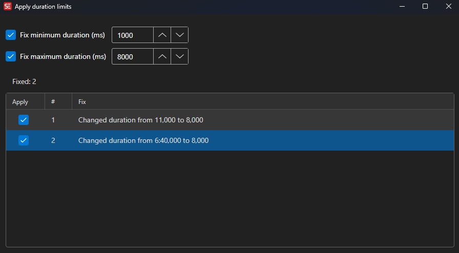

# Apply Duration Limits

Enforce minimum and maximum duration limits on subtitle lines.

- **Menu:** Tools → Apply duration limits...

<!-- Screenshot: Apply duration limits window -->

## Options

- **Minimum duration (ms)** — Set the minimum display time in milliseconds
- **Maximum duration (ms)** — Set the maximum display time in milliseconds

The preview list updates live as you change values. Lines that cannot be fully fixed (because there is not enough room before the next subtitle) are shown as partial fixes or skipped, and the counts are reported under the list.
