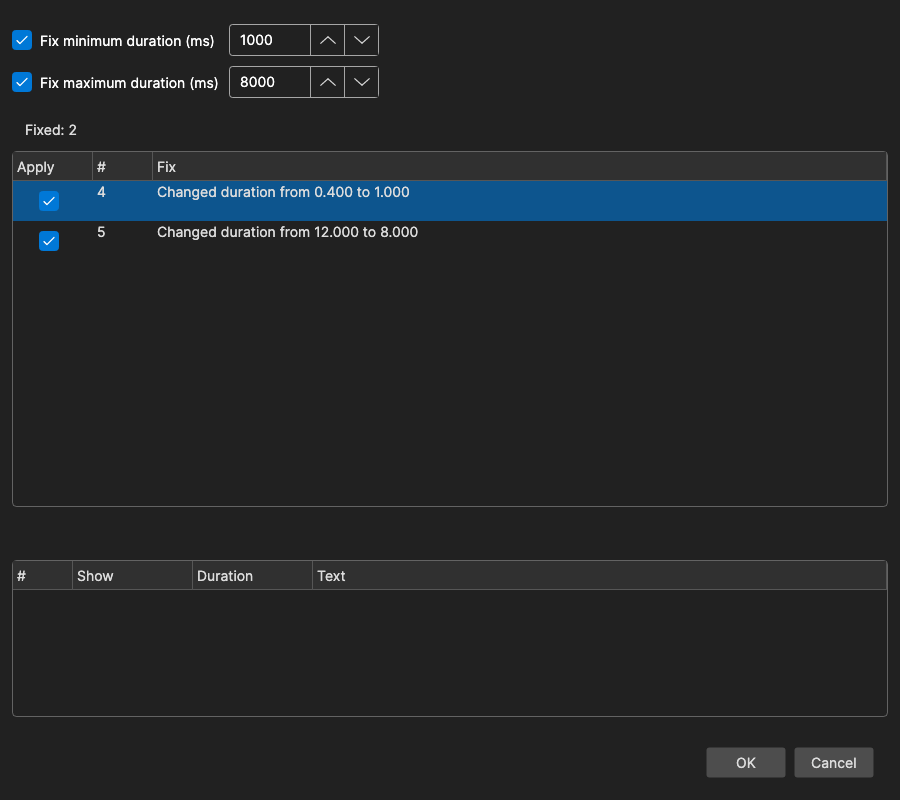

# Apply Duration Limits

Enforce minimum and maximum duration limits on subtitle lines.

- **Menu:** Tools → Apply duration limits...

<!-- Screenshot: Apply duration limits window -->

## Options

- **Fix min duration** — Enable the minimum limit and set the minimum display time in milliseconds
- **Do not go past shot change** — Shown when shot changes are loaded: a line extended to reach the minimum duration stops at the next shot change
- **Fix max duration** — Enable the maximum limit and set the maximum display time in milliseconds

The window shows two lists that update live as you change values: the proposed fixes, each with an **Apply** checkbox, and the lines that cannot be fixed (because there is not enough room before the next subtitle). The counts are reported under the lists.
