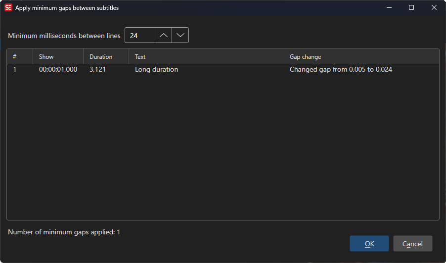

# Apply Minimum Gap

Set a minimum time gap between consecutive subtitles.

- **Menu:** Tools → Apply minimum gap...

<!-- Screenshot: Apply minimum gap window -->

## Options

- **Minimum gap** — The minimum time between subtitles (in milliseconds)
- **Frames** — Set gap in frames instead of milliseconds
- Preview affected lines before applying
