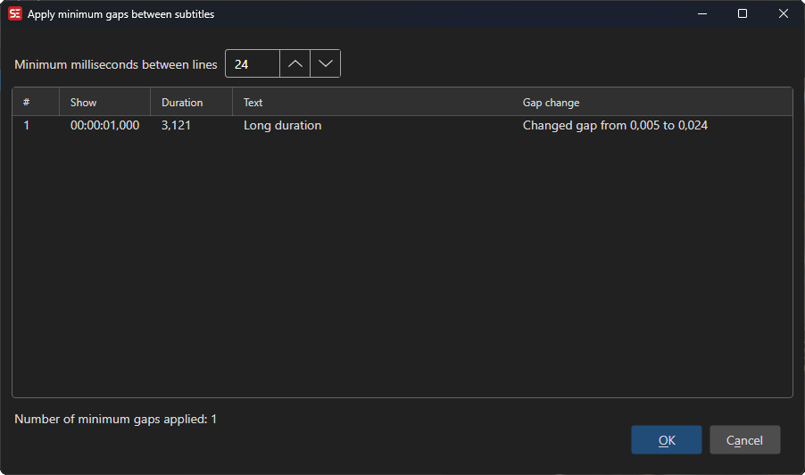

# Apply Minimum Gap

Set a minimum time gap between consecutive subtitles.

- **Menu:** Tools → Apply min. gap between subtitles...

<!-- Screenshot: Apply minimum gap window -->

## Options

- **Min. ms between lines / Min. frames between lines** — The minimum time between subtitles. The unit (milliseconds or frames) follows the global *Use time format HH:MM:SS:FF* setting.

The preview list updates live and the status text shows the number of gaps that were fixed.
