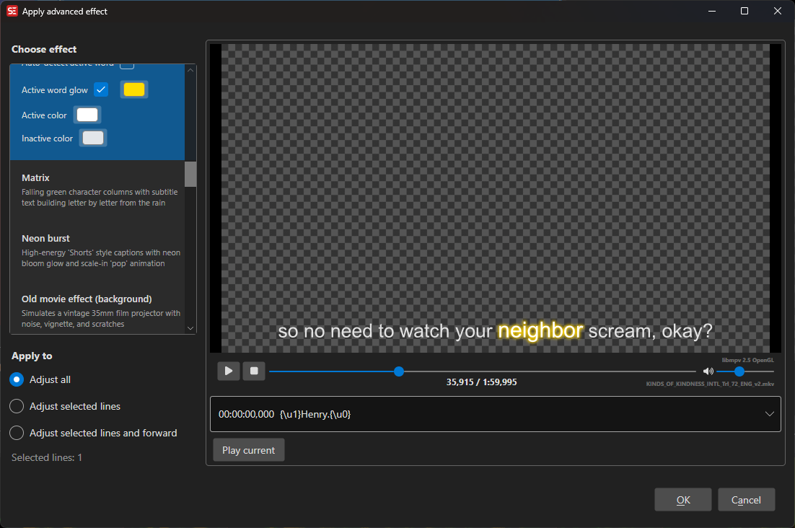

# ASSA Apply Advanced Effects

Apply cinematic and creative ASS/SSA override tag effects to subtitles with real-time video preview.

- **Menu:** ASSA tools → Apply advanced effects...
- **Shortcut:** Configurable

<!-- Screenshot: ASSA Apply Advanced Effects window -->

## Overview

This feature automatically generates complex ASSA override tag animations and effects for selected subtitle lines. Each effect creates frame-by-frame animations using ASSA's vector drawing and animation capabilities, with real-time video preview.

Effects range from text animations (typewriter, karaoke) to visual enhancements (neon glow, rainbow) to full-screen transitions and decorative elements (starfield, rain, old movie grain).

## How to Use

1. Open **ASSA tools → Apply advanced effects...**
2. Select an effect from the dropdown list
3. Choose which lines to affect:
   - **All lines** — Apply to entire subtitle
   - **Selected lines** — Apply only to selected lines
   - **Selected lines and forward** — Apply from first selected line to end
4. Preview the effect in the video player
5. Click **OK** to apply

## Available Effects

### Text Animation Effects

| Effect | Description |
|--------|-------------|
| **Typewriter** | Characters appear one-by-one as if being typed |
| **Typewriter with highlight** | Characters appear one-by-one with a glowing highlight on the active character |
| **Word by word** | Words appear one-by-one instead of characters |
| **Karaoke** | Classic karaoke color-wipe effect synchronized to subtitle timing |
| **Scramble reveal** | Text starts scrambled and gradually resolves to the correct characters |

### Visual Enhancement Effects

| Effect | Description |
|--------|-------------|
| **Neon burst** | Text appears with a neon glow and "pop" animation using modern colors |
| **Rainbow pulse** | Text cycles through rainbow colors with a pulsing animation |
| **Wave** | Text characters undulate in a wave motion |
| **Wave blue** | Blue-colored wave effect variant |

### Transition Effects

| Effect | Description |
|--------|-------------|
| **Fade in** | Screen fades in from black at the start of each subtitle |
| **Fade out** | Screen fades out to black at the end of each subtitle |

### Decorative/Atmospheric Effects

| Effect | Description |
|--------|-------------|
| **Star Wars scroll** | Classic opening crawl effect with perspective text scrolling into the distance |
| **End credits scroll** | Vertical scrolling credits effect |
| **Starfield** | Animated starfield background with moving stars |
| **Rain** | Animated falling rain particles across the screen |
| **Old movie** | Film grain, scratches, and imperfections simulating aged film stock |
| **Show** | Basic effect demonstrating the feature (for testing) |

## Effect Scope Options

### All Lines
Applies the effect to every subtitle line in the file.

### Selected Lines
Applies the effect only to the currently selected subtitle lines. Useful for applying effects to specific scenes or sections.

### Selected Lines and Forward
Applies the effect starting from the first selected line through to the end of the subtitle file.

## Real-Time Preview

The video player shows a live preview of the selected effect as you change options. The effect is rendered using a temporary ASS file and displayed over the video using libmpv's subtitle rendering.

- **Position control** — Seek through the video to preview the effect at different timestamps
- **Play/Pause** — Click the video surface to toggle playback
- **Subtitle list** — Select different subtitle lines to preview their effect

## Technical Details

### How Effects Work

Each effect generates ASSA override tags (`{\tag}`) to animate properties like:
- **Position** (`\pos`, `\move`)
- **Scale** (`\fscx`, `\fscy`)
- **Rotation** (`\frx`, `\fry`, `\frz`)
- **Color** (`\1c`, `\3c`, `\4c`)
- **Transparency** (`\alpha`, `\1a`, `\3a`, `\4a`)
- **Blur** (`\blur`)
- **Border** (`\bord`)
- **Transitions** (`\t(...)`)
- **Vector drawing** (`\p1`, drawing commands)

Many effects split a single subtitle line into multiple lines with sequential timing to create frame-by-frame animation.

### Video Resolution

Effects that involve positioning or drawing (starfield, rain, transitions) adapt to the video resolution. The feature automatically detects the video dimensions or uses a default of 1920×1080.

### Performance Considerations

- Complex effects (especially particle effects like starfield/rain/grain) generate many subtitle lines
- Each generated line adds to the ASS file size and rendering overhead
- Effects are optimized for modern playback engines (libmpv, mpv, VLC, etc.)
- Preview uses temporary files that are automatically cleaned up on close

## Tips

- **Preview before applying** — Always preview the full effect with the video before committing
- **Test with different scenes** — Some effects look better in bright/dark scenes
- **Combine with styles** — Effects respect the base ASSA style but may override specific properties
- **Selective application** — Use "Selected lines" to apply different effects to different scenes
- **Experiment** — Each effect has its own aesthetic; try multiple effects to find the right fit

## Keyboard Shortcuts

| Key | Action |
|-----|--------|
| Escape | Close without applying |

## Related Features

- [ASSA Styles](assa-styles.md) — Manage base styles for text appearance
- [ASSA Apply Custom Override Tags](assa-override-tags.md) — Manually add override tags to specific subtitles
- [ASSA Properties](assa-properties.md) — Edit script-level properties (resolution, aspect ratio, etc.)
- [ASSA Draw](assa-draw.md) — Create custom vector shapes and drawings
