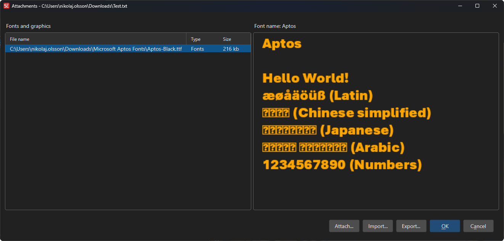

# ASSA Attachments

Manage fonts and images embedded as attachments in an Advanced SubStation Alpha (ASS/SSA) subtitle file.

**Menu:** `ASSA` → `Attachments...`

## How to Use

1. Open a subtitle file in ASS/SSA format.
2. Go to **ASSA** → **Attachments...** to open the attachments manager.
3. View the list of currently embedded fonts and images.
4. Use **Add** to attach new font or image files.
5. Select an attachment and use **Delete** or **Delete All** to remove attachments.
6. Select an image attachment to see a preview.
7. Click **OK** to save changes.

## Features

### Font Attachments
- Embed TrueType (.ttf) and OpenType (.otf) font files directly in the subtitle file.
- Ensures the correct fonts are available regardless of the system fonts installed.

### Image Attachments
- Embed image files (PNG, JPG, GIF, BMP, ICO) in the subtitle file.
- Preview embedded images directly in the dialog.

### Management
- Add one or more attachments at a time.
- Delete individual attachments or clear all attachments.
- View attachment names and sizes.

## Keyboard Shortcuts

| Shortcut | Action |
|----------|--------|
| F1 | Show help |
| Escape | Close dialog |
