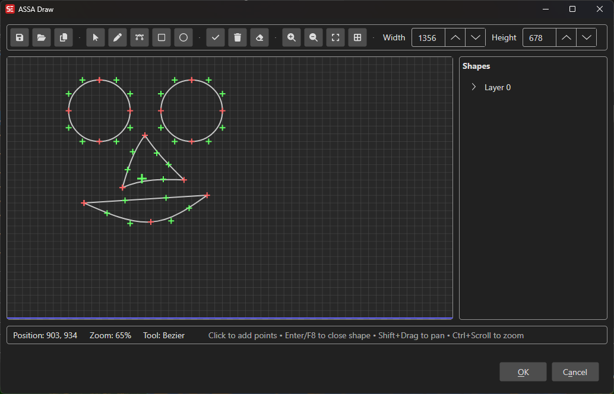

# ASSA Draw

A vector drawing tool for creating ASSA drawing commands (\p1 ... \p0) used in Advanced SubStation Alpha subtitles.

**Menu:** `ASSA` → `Draw...`

## How to Use

1. Go to **ASSA** → **Draw...** to open the drawing canvas.
2. Select a drawing tool (Line, Bézier curve, etc.) from the toolbar.
3. Click on the canvas to create points and shapes.
4. Use the shape tree on the side to manage layers and shapes.
5. Adjust individual point coordinates for precise positioning.
6. Toggle the grid overlay for alignment guidance.
7. Click **OK** to insert the generated ASSA drawing code into your subtitle.

## Features

### Drawing Tools
- **Line:** Draw straight line segments.
- **Bézier Curve:** Draw smooth curves with control points.
- **Eraser:** Remove shapes or points.

### Canvas
- Configurable canvas size (default 1920×1080).
- Zoom in/out for detailed editing.
- Grid overlay for alignment.
- Real-time position display.

### Shape Management
- Organize shapes in a tree view with layers.
- Select, move, and delete shapes or individual points.
- Set layer colors.
- Edit exact X/Y coordinates for selected points.

### Import / Export
- Open existing ASSA drawing files.
- Save drawing code as files.
- Copy generated ASSA drawing code to the subtitle.

## Keyboard Shortcuts

| Shortcut | Action |
|----------|--------|
| F1 | Show help |
| Escape | Close dialog |
