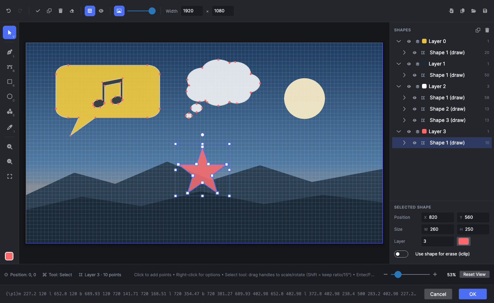
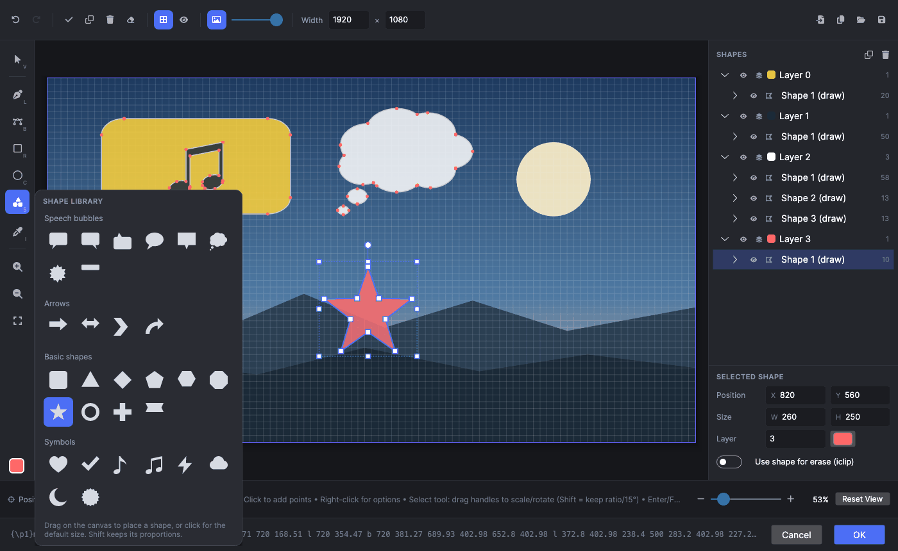
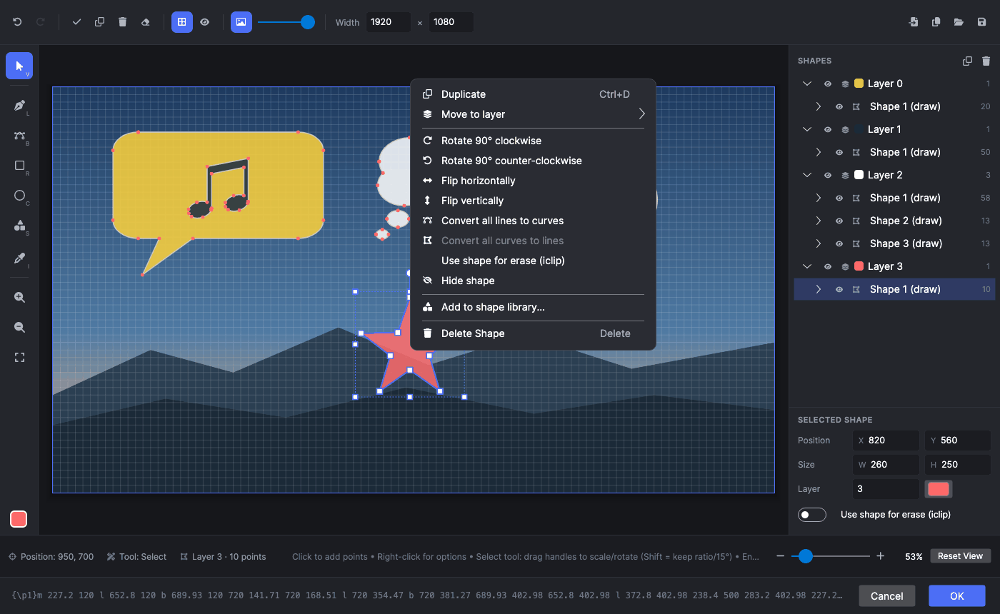

# ASSA Draw

A vector drawing editor for ASSA drawings (`\p1 ... \p0`) in Advanced SubStation Alpha subtitles: speech bubbles, arrows, logos, masks and other shapes drawn on top of the video.

**Menu:** `ASSA tools` → `Draw...`

The window works like a vector drawing program:

- **Options bar** (top): undo/redo, shape actions, grid and preview toggles, background, canvas size, and Import SVG/Copy/Load/Save.
- **Tool strip** (left): the drawing tools, zoom, and the current color.
- **Canvas** (center): the video frame area (the script resolution).
- **Shapes panel** (right): layers, shapes and points, with the properties of what is selected.
- **Status bar** (bottom): pointer position, tool, selection, and zoom. The generated ASSA code is shown next to **OK** and **Cancel**.

## How to Use

1. Select one or more lines and go to **ASSA tools** → **Draw...**. Drawings already in the selected lines are loaded.
2. Pick a tool in the tool strip and draw on the canvas, or place a ready-made shape with the **Shape tool**.
3. Use the **Select** tool to move, scale and rotate shapes. Right-click anything for more options.
4. Click **OK** to write the drawing back to the subtitle. Each layer becomes one line with its own color.

## Tools

| Tool | Key | What it does |
|------|-----|--------------|
| Select | `V` | Click a shape to select it, and drag it to move it. Drag the handles around the selection to scale it, or the round handle above it to rotate it. |
| Line | `L` / `F4` | Click to add straight-line points. `Enter`/`F8` closes the shape, and `Esc` cancels it. |
| Bézier curve | `B` / `F5` | Click to add curve points. Drag the green control points to shape the curves. |
| Rectangle | `R` / `F6` | Click two corners. |
| Circle | `C` / `F7` | Click the center, then the radius. |
| Shape tool | `S` | Places a shape from the [shape library](#shape-library). |
| Eyedropper | `I` | Picks a color from a shape or from the background. |

Drag a point with any tool to move it. The single-letter keys are ignored while typing in a number field.

### Scale and rotate

With the **Select** tool, a selected shape (or a multi-selection, `Ctrl+A`) gets eight scale handles and a rotate handle:

- The dragged edge or corner follows the pointer, and the opposite side stays in place.
- Hold `Shift` while dragging a corner to keep the proportions, or while rotating to snap to 15° steps.
- The size or angle is shown while dragging.
- Dragging a shape that is part of a multi-selection moves the whole selection.

## Shape Library

Click the **Shape tool** to open the shape library, then pick a shape:

- **Drag** on the canvas to place the shape in that rectangle. Hold `Shift` to keep its proportions.
- **Click** to place it at a default size, centered on the click.

The shape is placed on a new layer in the current color and selected with the Select tool, ready to be moved or resized.

Built-in shapes:

- **Speech bubbles:** speech bubble (tail left, right or up), oval, box, thought, shout, caption box.
- **Arrows:** arrow, double arrow, chevron, curved arrow.
- **Basic shapes:** rounded rectangle, triangle, diamond, pentagon, hexagon, octagon, star, ring, plus, banner.
- **Symbols:** heart, check mark, music note, music notes, lightning, cloud, moon, badge.

**My shapes:** To save your own shape, right-click a shape (or a multi-selection) and choose **Add to shape library...**. Saved shapes keep their colors, one per layer. Right-click a saved shape in the library to remove it.

## Colors and Layers

ASSA drawings have one color per line, so each **layer** has one color. The layer color is shown as a swatch in the shapes panel and at the bottom of the tool strip (the current color).

- New shapes use the current color. They join the layer that already has that color, or a new layer.
- To change a color, select a shape or layer and use the color swatch in the properties panel.
- **Eyedropper** (`I`): click a shape to take its color, or click the background (video frame or image) to take that pixel's color. A preview of the color under the pointer follows the cursor. The picked color becomes the current color and recolors the selected shape's layer.
- **Use shape for erase (iclip):** turns a shape into a cut-out (`\iclip`) of its layer. Eraser shapes are drawn dashed.

## Right-click Menus

- **Shape:**
  - Duplicate (`Ctrl+D`), Move to layer
  - Rotate 90° clockwise/counter-clockwise, Flip horizontally/vertically
  - Convert all lines to curves / all curves to lines
  - Use shape for erase, Hide shape
  - Add to shape library..., Delete shape (`Del`)
- **Point:**
  - Convert segment to curve / to line
  - Delete point. A curve's end point takes its control points with it.
- **Empty canvas:**
  - Undo/redo, Close shape/Cancel drawing (while drawing), Select all
  - Zoom, Grid, Preview
  - Import SVG image..., Background, Clear all
- **Shapes panel:** the same shape and point items. On a layer: Hide/show layer, Change layer, Delete layer.

## Shapes Panel

- Layers contain shapes, and shapes contain their points. Click the eye button to hide or show a layer or shape. Hidden shapes are not included in the preview.
- **Selected shape:** edit its position (X/Y), size (W/H), layer number and color, and turn **Use shape for erase (iclip)** on or off.
- **Selected point:** edit its exact X/Y coordinates.
- Selecting a shape or point on the canvas selects it in the panel, and the other way around.

## Background

Use the **Background** button (picture icon) in the options bar to show something behind the drawing to trace over:

- **Video frame (current position):** the frame at the video position (or at the start of the selected line).
- **Video frame at...:** a frame at a time code you type.
- **Image file...:** a PNG, JPG, BMP or WebP image. You can also drop an image on the window.
- **Stretch image to canvas:** otherwise the image keeps its aspect ratio and is centered.
- **No background**.

The slider next to the button sets the background opacity. The background is only for display and is never part of the result.

## Import SVG Images

Use **Import SVG** in the options bar or the canvas menu, or drop an `.svg` file on the window. The SVG is converted to ASSA drawing shapes:

- Supported: paths, rectangles, circles, ellipses, lines, polygons and polylines, groups, `<use>` and transforms. Arcs and quadratic curves become Bézier curves.
- Each fill color becomes its own layer, in the order of the SVG file. Strokes become filled outlines on their own layer, and holes are kept.
- Colors and opacity come from attributes, `style`, and simple `.class` rules. Gradients use their first color.
- An SVG with the frame's aspect ratio fills the frame. Other SVGs are fitted to half the frame and centered.
- Not supported: gradients (as gradients), patterns, masks and clip paths, text, and filters.

## Preview

**Toggle preview** (`F9`) shows the drawing as libass renders it: filled, in the layer colors, with eraser shapes cut out. The outlines and points stay on top for editing. This needs ffmpeg with libass.

## Undo and Redo

Every change can be undone with `Ctrl+Z` and redone with `Ctrl+Y` or `Ctrl+Shift+Z` (`⌘` on macOS). While you are drawing a shape, undo removes the last point you added. A whole drag, or holding an arrow key, counts as one step.

## Keyboard Shortcuts

| Shortcut | Action |
|----------|--------|
| `V` `L` `B` `R` `C` `S` `I` | Select, line, Bézier, rectangle, circle, shape tool, eyedropper |
| `F4`–`F7` | Line, Bézier, rectangle, circle |
| `Enter` / `F8` | Close the shape being drawn |
| `Esc` | Cancel the shape being drawn (or close the dialog) |
| `Del` | Delete the selected shape |
| `Ctrl+Z` / `Ctrl+Y` | Undo / redo |
| `Ctrl+D` | Duplicate the selected shape |
| `Ctrl+A` | Select all shapes |
| `Ctrl+Arrow` / `Alt+Arrow` | Move the selection 10 px / 1 px |
| `Ctrl` + mouse wheel | Zoom around the pointer |
| `Ctrl++` / `Ctrl+-` / `Ctrl+0` | Zoom in / zoom out / fit the frame |
| `Shift` + drag, middle mouse button | Pan |
| `Ctrl+G` | Toggle the grid |
| `F9` | Toggle the libass preview |
| `Ctrl+C` | Copy the ASSA code to the clipboard |
| `Ctrl+N` | Clear all |
| `F1` | Show help |
