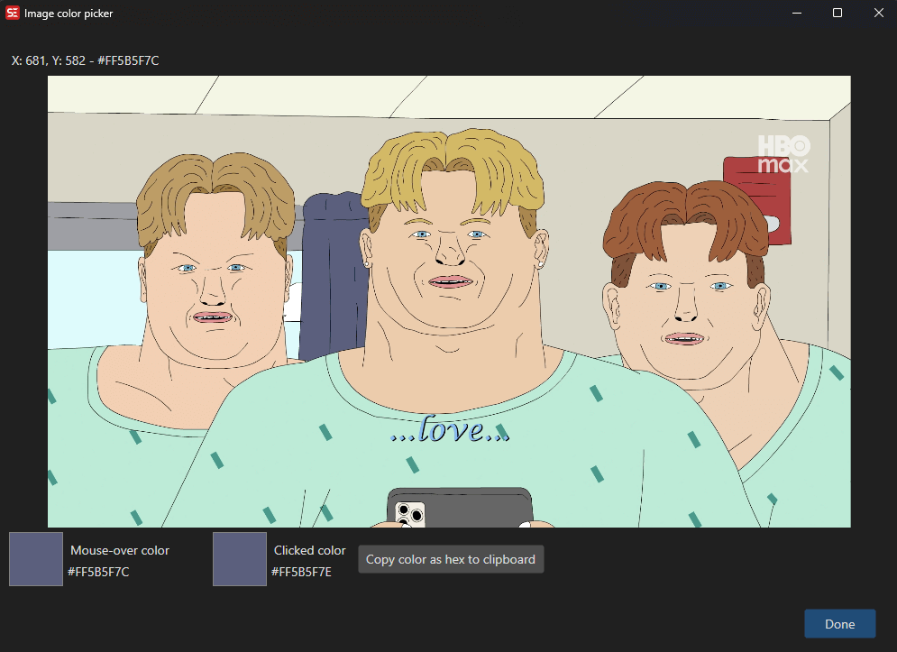

# ASSA Image Color Picker

Pick colors directly from a video frame screenshot for use in ASSA subtitle styles and override tags.

**Menu:** `ASSA` → `Image Color Picker...`

## How to Use

1. Load a video and select a subtitle line.
2. Go to **ASSA** → **Image Color Picker...** to open the color picker.
3. A screenshot of the current video frame is displayed.
4. Move the mouse over the image — the current color under the cursor is shown in real time.
5. Click on the image to select a color.
6. Use **Copy** to copy the selected color as a hex value to the clipboard.
7. Click **OK** to apply.

## Features

### Color Picking
- Real-time color preview as you move the mouse over the video frame.
- Click to lock in a color.
- Displays both the current mouse color and the last clicked color.

### Color Display
- Shows colors as hex values (e.g., `#FF00FF00`).
- Visual color swatch for both current and selected colors.

### Copy to Clipboard
- Copy the selected color as a hex string for use in ASSA override tags or style editors.

### Resolution Handling
- Source and target resolution support for accurate coordinate mapping.

## Keyboard Shortcuts

| Shortcut | Action |
|----------|--------|
| F1 | Show help |
| Escape | Close dialog |
