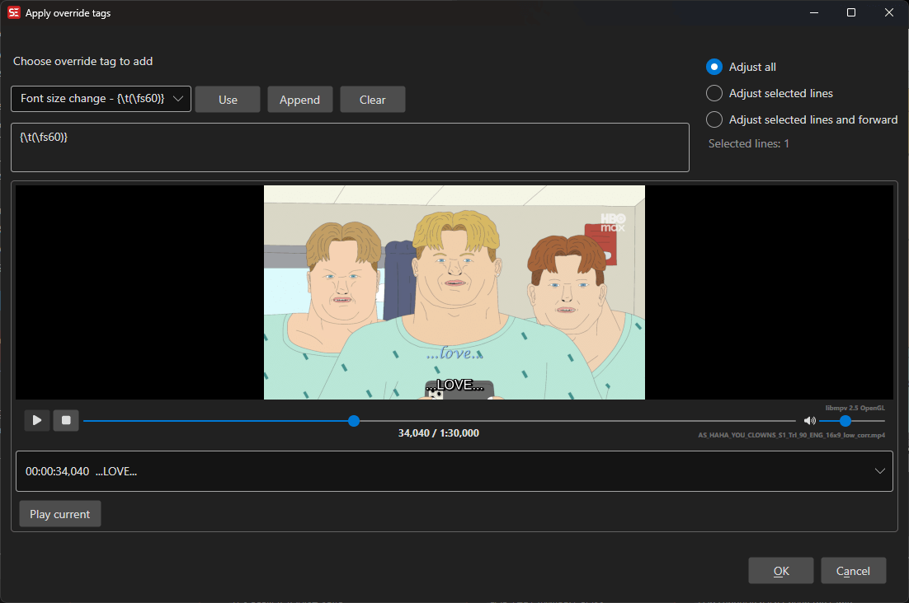

# ASSA Apply Custom Override Tags

Apply custom ASSA override tags to subtitle lines with a live video preview.

**Menu:** `ASSA` → `Apply Custom Override Tags...`

## How to Use

1. Load a video and subtitle file in ASSA format.
2. Optionally select specific subtitle lines to apply tags to.
3. Go to **ASSA** → **Apply Custom Override Tags...** to open the dialog.
4. Select an override tag from the list or enter a custom tag.
5. Choose the scope: all lines, selected lines, or selected lines and forward.
6. Preview the result in the built-in video player.
7. Click **OK** to apply the override tags.

## Features

### Override Tag Selection
- Browse a list of common ASSA override tags.
- Select from predefined tags or build custom tag combinations.
- Remembers the last used override tag.

### Application Scope
- **All lines:** Apply the tag to every line in the subtitle.
- **Selected lines:** Apply only to the currently selected lines.
- **Selected lines and forward:** Apply to the selected lines and all subsequent lines.

### Live Preview
- Built-in video player shows the effect of the override tags in real time.
- Subtitle list displays all lines with current text.

### Selection Info
- Displays information about how many lines will be affected.

## Keyboard Shortcuts

| Shortcut | Action |
|----------|--------|
| F1 | Show help |
| Escape | Close dialog |
