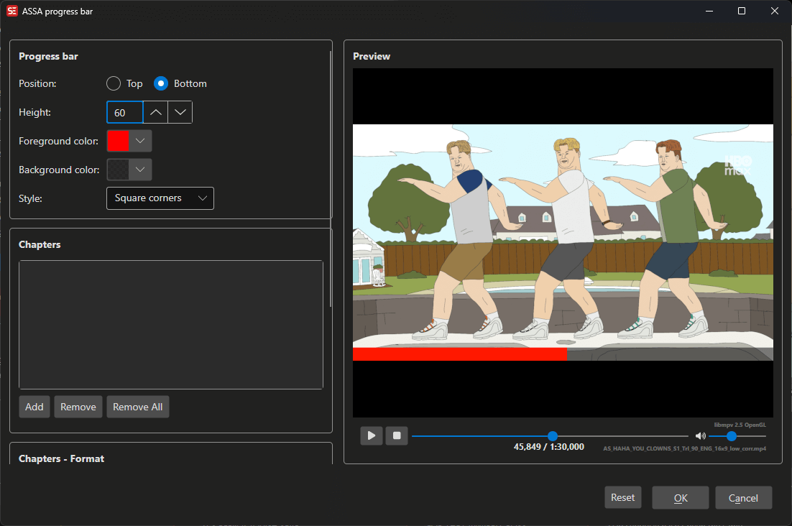

# ASSA Progress Bar

Generate an animated progress bar overlay in ASSA format, with optional chapter markers.

**Menu:** `ASSA` → `Progress Bar...`

## How to Use

1. Load a video and subtitle file in ASSA format.
2. Go to **ASSA** → **Progress Bar...** to open the progress bar dialog.
3. Configure the bar position, height, colors, and corner style.
4. Optionally add chapter markers with text labels.
5. Preview the result in the built-in video player.
6. Click **OK** to generate the progress bar and add it to your subtitle.

## Features

### Bar Settings
- **Position:** Top or bottom of the video.
- **Height:** Bar height in pixels.
- **Foreground color:** Color of the progress fill.
- **Background color:** Color of the unfilled portion.
- **Text color:** Color of chapter text labels.
- **Corner style:** Square or rounded corners.

### Chapters
- Add chapter markers at specific time positions.
- Each chapter has a name and start time.
- Configurable splitter width and height for chapter dividers.

### Text Settings
- Font name and size for chapter labels.
- X and Y position adjustments.
- Text alignment: left, center, or right.

### Live Preview
- Built-in video player with real-time preview of the progress bar.
- Preview code displayed for inspection.

## Keyboard Shortcuts

| Shortcut | Action |
|----------|--------|
| F1 | Show help |
| Escape | Close dialog |
