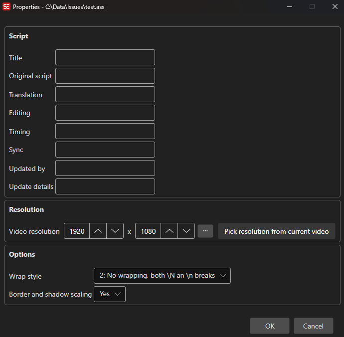

# ASSA Properties

Edit the script info header properties of an Advanced SubStation Alpha (ASS/SSA) subtitle file.

**Menu:** `ASSA tools` → `Properties...`

## How to Use

1. Open a subtitle file in ASS/SSA format.
2. Go to **ASSA tools** → **Properties...** to open the properties dialog.
3. Edit the script info fields as needed.
4. Set the video resolution (PlayResX / PlayResY) — the **...** button picks a standard resolution, and **Pick resolution from current video** is shown when a video is loaded.
5. Choose a wrap style and border/shadow scaling mode.
6. Click **OK** to save changes.

## Features

### Script Info Fields
- **Title:** The title of the script.
- **Original Script:** Author of the original script.
- **Translation:** Translator name.
- **Editing:** Editor name.
- **Timing:** Timer name.
- **Sync Point:** Synchronization reference.
- **Updated By:** Name of the person who last updated the script.
- **Update Details:** Description of the last update.

### Video Resolution
- **Video Width / Height:** Sets the PlayResX and PlayResY values used for style positioning.
- **...** button: Pick from a list of standard resolutions (4K DCI, 4K UHD, Full HD 1080p, HD 720p, SD PAL, ...).
- **Pick resolution from current video:** Fills width and height from the currently loaded video; only shown when a video is loaded.

### Wrap Style
- Controls how long lines are word-wrapped (smart wrapping, end-of-line wrapping, no wrapping, or smart wrapping with wider lower line).

### Border and Shadow Scaling
- Choose whether border and shadow sizes scale with the script resolution or the video resolution.
- The dropdown offers **Yes**, **No** and **N/A** (not set).

## Keyboard Shortcuts

| Shortcut | Action |
|----------|--------|
| F1 | Show help |
| Escape | Close dialog |
