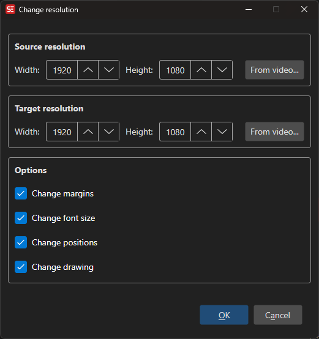

# ASSA Resolution Resampler

Resample ASSA subtitle styles and positions from one video resolution to another, so subtitles look correct at a different resolution.

**Menu:** `ASSA` → `Resolution Resampler...`

## How to Use

1. Open a subtitle file in ASS/SSA format.
2. Go to **ASSA** → **Resolution Resampler...** to open the resampler dialog.
3. The **Source resolution** is read from the subtitle header (PlayResX / PlayResY).
4. Set the **Target resolution** — if a video is loaded, it is used as the default.
5. Choose which elements to resample (margins, font sizes, positions, drawings).
6. Click **OK** to apply the resampling.

## Features

### Resolution Settings
- **Source Width / Height:** The original resolution the subtitle was authored for (read from the subtitle header).
- **Target Width / Height:** The new resolution to resample to.

### Resample Options
- **Change margins:** Scale left, right, and vertical margins.
- **Change font size:** Scale font sizes proportionally.
- **Change positions:** Scale \pos, \move, and \org coordinates.
- **Change drawing:** Scale \p drawing coordinates.

### Automatic Detection
- Source resolution is automatically read from the subtitle's Script Info header.
- Target resolution defaults to the currently loaded video's dimensions.

## Keyboard Shortcuts

| Shortcut | Action |
|----------|--------|
| F1 | Show help |
| Escape | Close dialog |
