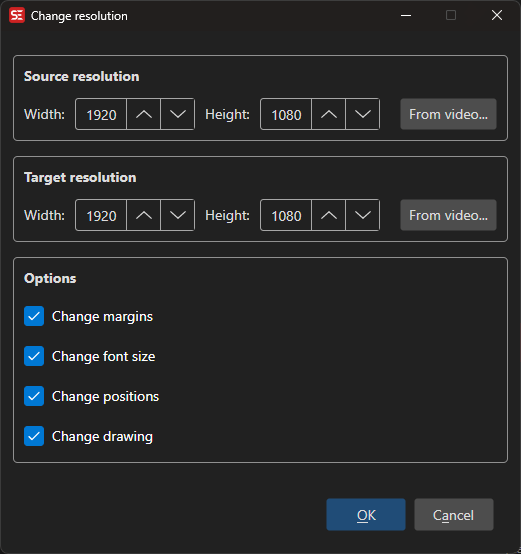

# ASSA Resolution Resampler

Resample ASSA subtitle styles and positions from one video resolution to another, so subtitles look correct at a different resolution.

**Menu:** `ASSA tools` → `Change resolution...`

## How to Use

1. Open a subtitle file in ASS/SSA format.
2. Go to **ASSA tools** → **Change resolution...** to open the resampler dialog.
3. The **Source resolution** is read from the subtitle header (PlayResX / PlayResY).
4. Set the **Target resolution** — if a video is loaded, it is used as the default.
5. Choose which elements to resample (margins, font sizes, positions, drawings).
6. Click **OK** to apply the resampling.

## Features

### Resolution Settings
- **Source Width / Height:** The original resolution the subtitle was authored for (read from the subtitle header).
- **Target Width / Height:** The new resolution to resample to.

### Resample Options
- **Change margins:** Scale left, right, and vertical margins.
- **Change font size:** Scale font sizes proportionally.
- **Change positions:** Scale \pos, \move, and \org coordinates.
- **Change drawing:** Scale \p drawing coordinates.

### Automatic Detection
- Source resolution is automatically read from the subtitle's Script Info header.
- Target resolution defaults to the currently loaded video's dimensions.

## Keyboard Shortcuts

| Shortcut | Action |
|----------|--------|
| F1 | Show help |
| Escape | Close dialog |

## Resolution set from the video

When a video is opened and the subtitle's PlayResX / PlayResY differ from the video's picture size, this dialog opens by itself, pre-filled with the subtitle resolution as source and the video resolution as target - the same check Aegisub makes when loading a video. Press **OK** to resample the subtitle to the video, or **Cancel** to leave it as it is. Untick *Ask when a video with a different resolution is opened* to stop the prompt; the subtitle is then resampled to the video automatically.

Both behaviours can be changed under *Options → Settings → Subtitle formats*:

- **ASSA: set resolution (PlayResX/PlayResY) from the video when a video is opened** - turn off to never touch the resolution on video load.
- **ASSA: ask before changing the resolution to match the video** - turn off to resample automatically instead of showing the dialog.

The resampling only applies to a subtitle whose header already names a resolution - a file authored for another picture size. A header without PlayResX / PlayResY is the built-in one, or your default style storage written into it (an OCR result takes that route): there the video's dimensions are written into the header silently, only the small built-in font sizes (25 and below) are lifted to the video height, and your font size, margins, outline and shadow are kept exactly as configured.
