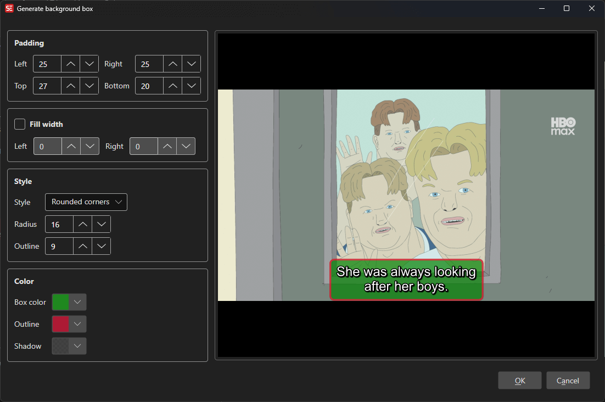

# ASSA Set Background

Add styled background boxes behind subtitle text using ASSA drawing commands.

**Menu:** `ASSA` → `Set Background Box...`

## How to Use

1. Load a video and subtitle file in ASSA format.
2. Go to **ASSA** → **Set Background Box...** to open the background dialog.
3. Configure the background box style — shape, colors, padding, and outline.
4. Preview the result in the built-in video player.
5. Click **OK** to apply the background box to your subtitle.

## Features

### Box Styles
- **Square corners:** Rectangular background box.
- **Rounded corners:** Background box with configurable corner radius.
- **Circle:** Circular background shape.

### Padding
- Configure left, right, top, and bottom padding independently.

### Colors
- **Box color:** Background fill color.
- **Outline color:** Border/outline color around the box.
- **Shadow color:** Shadow color.

### Outline and Shadow
- Adjustable outline width.
- Adjustable shadow distance.

### Fill Width
- Option to fill the full width of the video with configurable left and right margins.

### Live Preview
- Built-in video player shows a real-time preview of the background effect.

## Keyboard Shortcuts

| Shortcut | Action |
|----------|--------|
| F1 | Show help |
| Escape | Close dialog |
