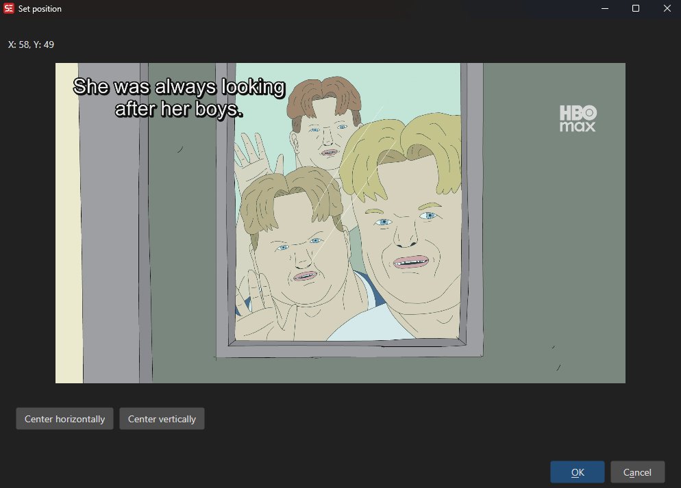

# ASSA Set Position

Visually position subtitles on screen by dragging them over a video screenshot, generating the appropriate ASSA \pos override tag.

**Menu:** `ASSA` → `Set Position...`

## How to Use

1. Load a video and select a subtitle line.
2. Go to **ASSA** → **Set Position...** to open the positioning dialog.
3. A screenshot of the current video frame is shown with the subtitle text overlaid.
4. Drag the subtitle text to the desired position on the screen.
5. The position coordinates update in real time.
6. Click **OK** to apply the \pos tag to the selected subtitle line(s).

## Features

### Visual Positioning
- Drag-and-drop subtitle text over a video screenshot.
- Real-time coordinate display.
- Supports left, center, and right horizontal alignment.
- Supports top, center, and bottom vertical alignment.

### Resolution Handling
- Source and target resolution settings.
- Automatically scales positions between different video resolutions.

### Result
- Generates ASSA \pos(x,y) override tags.
- Updates the subtitle with the new position.

## Keyboard Shortcuts

| Shortcut | Action |
|----------|--------|
| F1 | Show help |
| Escape | Close dialog |
