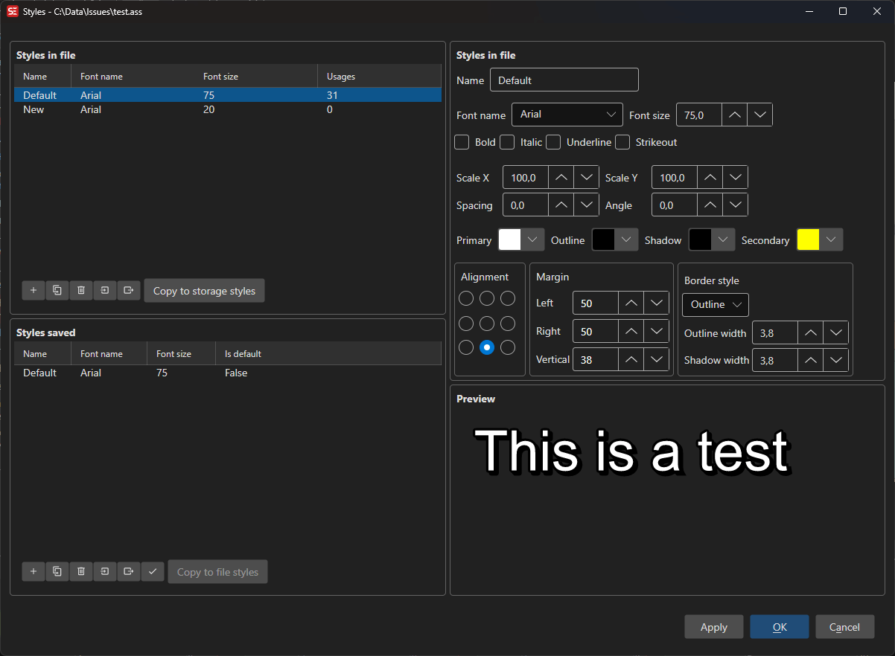

# ASSA Styles

Manage Advanced SubStation Alpha (ASS/SSA) subtitle styles, including file styles and storage (template) styles.

**Menu:** `ASSA` → `Styles...`

## How to Use

1. Open a subtitle file in ASS/SSA format (or convert your current subtitle to ASSA format).
2. Go to **ASSA** → **Styles...** to open the styles manager.
3. The left panel shows **File Styles** (styles in the current subtitle), and the right panel shows **Storage Styles** (reusable template styles).
4. Select a style to view and edit its properties — font, colors, border, shadow, alignment, margins, and more.
5. Use the preview area to see how your style looks.
6. Click **OK** to apply changes.

## Features

### File Styles
- View all styles defined in the current subtitle file.
- Add, remove, copy, or rename styles.
- Import styles from other subtitle files.

### Storage Styles
- Maintain a library of reusable styles separate from any subtitle file.
- Copy styles between file and storage.
- Set a style as the default for new subtitles.

### Style Properties
- **Font:** Name, size, bold, italic, underline, strikeout.
- **Colors:** Primary, secondary, outline, and back (shadow) colors.
- **Border:** Outline width and border style (outline + shadow or opaque box).
- **Shadow:** Shadow depth.
- **Alignment:** 9-position alignment grid.
- **Margins:** Left, right, and vertical margins.

### Preview
- Live preview of the selected style with sample text.
- Preview updates as you change style properties.

## Keyboard Shortcuts

| Shortcut | Action |
|----------|--------|
| F1 | Show help |
| Escape | Close dialog |
