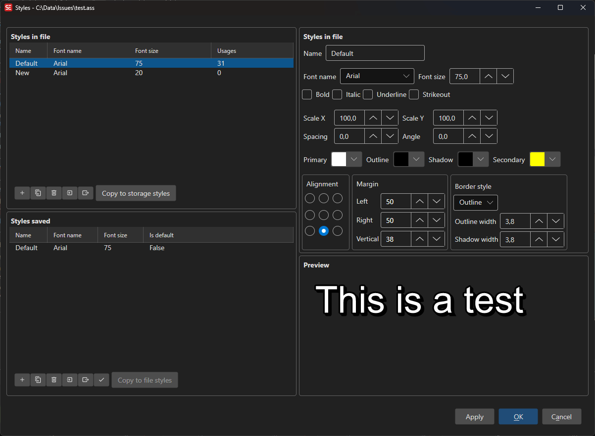

# ASSA Styles

Manage Advanced SubStation Alpha (ASS/SSA) subtitle styles, including file styles and storage (template) styles.

**Menu:** `ASSA tools` → `Styles...`

## How to Use

1. Open a subtitle file in ASS/SSA format (or convert your current subtitle to ASSA format).
2. Go to **ASSA tools** → **Styles...** to open the styles manager.
3. The left panel shows **File Styles** (styles in the current subtitle), and the right panel shows **Storage Styles** (reusable template styles).
4. Select a style to view and edit its properties — font, colors, border, shadow, alignment, margins, and more.
5. Use the preview area to see how your style looks.
6. Click **OK** to apply changes.

> **Important:** Only **File Styles** affect the current subtitle. **Storage Styles** are a personal template library that lives outside any subtitle file — editing one (or creating a new one) and clicking **OK** will *not* change how your subtitle looks. To apply a storage style to the current subtitle, first copy it into the file styles (select it in the right panel and use **Copy to file styles**), then make sure your subtitle lines use that style name. See [Storage Styles](#storage-styles) below.

## Features

### File Styles
- View all styles defined in the current subtitle file.
- Add, remove, copy, or rename styles.
- Import styles from other subtitle files.

### Storage Styles
- Maintain a library of reusable styles separate from any subtitle file.
- Storage styles are **templates only** — they are saved with your settings and reused across subtitles, but they do not belong to the current subtitle and do not change its appearance on their own.
- **To apply a storage style to the current subtitle:** select it in the right panel, choose **Copy to file styles**, then assign that style to the relevant subtitle lines.
- Copy styles between file and storage.
- Set a style as the default for new subtitles (this only affects newly created/converted subtitles, not the current one).

### Style Properties
- **Font:** Name, size, bold, italic, underline, strikeout.
- **Colors:** Primary, secondary, outline, and back (shadow) colors.
- **Border:** Outline width and border style (outline + shadow or opaque box).
- **Shadow:** Shadow depth.
- **Alignment:** 9-position alignment grid.
- **Margins:** Left, right, and vertical margins.

### Preview
- Live preview of the selected style with sample text.
- Preview updates as you change style properties.

## Keyboard Shortcuts

| Shortcut | Action |
|----------|--------|
| F1 | Show help |
| Escape | Close dialog |
