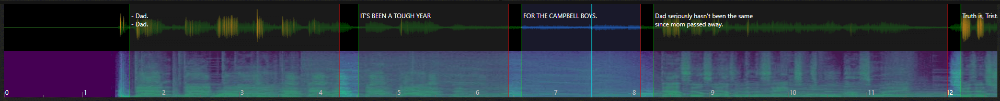
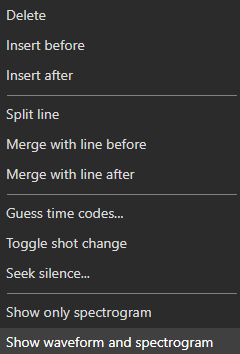

# Audio Visualizer

The audio visualizer displays the audio waveform (and/or spectrogram) of the loaded video, enabling precise visual timing of subtitles.

<!-- Screenshot: Audio visualizer -->

## Display Modes

- **Waveform** — Shows audio amplitude over time
- **Spectrogram** — Shows frequency distribution over time

## Mouse Controls

### Navigation
| Mouse Action | Effect |
|--------------|--------|
| **Scroll wheel** | Scroll waveform left/right |
| **Ctrl+Scroll wheel** | Horizontal zoom in/out |
| **Shift+Scroll wheel** | Vertical zoom in/out |
| **Middle-click drag** | Pan the waveform |

### Subtitle Timing
| Mouse Action | Effect |
|--------------|--------|
| **Click + Ctrl (cmd on mac) + Shift ** | Set start and offset the rest |
| **Click + Shift ** | Set start of current |
| **Click + Ctrl (cmd on mac) ** | Set end of current |
| **Click** on empty area | Set video position |
| **Click** on subtitle | Select the subtitle |
| **Double-click** on subtitle | Set video position and select subtitle |
| **Drag** subtitle left/right edge | Adjust start/end time |
| **Drag** subtitle body | Move entire subtitle |
| **Right-click** | Context menu |

### Creating New Subtitles
| Mouse Action | Effect |
|--------------|--------|
| **Click+Drag** in empty area | Create a new subtitle with the selected time range |

## Keyboard Shortcuts (Waveform)

| Shortcut | Action |
|----------|--------|
| Set start | Set the start time of the selected subtitle |
| Set end | Set the end time of the selected subtitle |
| Set end and go to next | Set end time and move to next subtitle |
| Set start and offset the rest | Set start and shift all following subtitles |
| Set end and offset the rest | Set end and shift all following subtitles |
| Center on video position | Center the waveform on the current video position |
| Insert at position (focus text) | Insert a new subtitle at video position and focus the text editor |
| Insert at position (no focus) | Insert a new subtitle at video position |
| Seek silence | Find the next silent section |

> **Note:** Actual key bindings depend on your shortcut configuration. See **Options → Shortcuts** to view or change them.

## Toolbar

The waveform toolbar (when visible) provides buttons for:
- Zoom in/out (horizontal and vertical)
- Toggle waveform/spectrogram mode
- Toggle grid lines

## Shot Changes

Shot changes (scene cuts) are displayed as vertical lines on the waveform. These help align subtitle timing with scene transitions.

- **Toggle shot change at video position** — Add or remove a shot change marker
- **Go to previous/next shot change** — Navigate between shot changes
- **Snap to nearest shot change** — Align subtitle edges to nearby shot changes
- **Extend to next shot change** — Extend subtitle to the next scene cut

## Context Menu

Right-click on the waveform for options including:
- Add subtitle at position
- Split subtitle
- Merge subtitles
- Delete subtitle
- Go to subtitle
- Zoom controls

<!-- Screenshot: Waveform context menu -->

