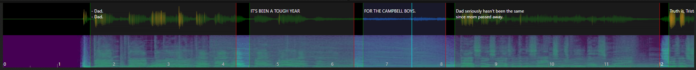
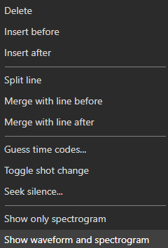

# Audio Visualizer

The audio visualizer displays the audio waveform (and/or spectrogram) of the loaded video, enabling precise visual timing of subtitles.

<!-- Screenshot: Audio visualizer -->

## Display Modes

- **Waveform** — Shows audio amplitude over time
- **Spectrogram** — Shows frequency distribution over time

The spectrogram can be generated and toggled independently of the waveform. If you disable spectrogram generation, Subtitle Edit hides the spectrogram layer and keeps the waveform view available.

## Mouse Controls

### Navigation

| Mouse Action | Effect |
|--------------|--------|
| **Scroll wheel** | Scroll waveform left/right |
| **Alt+Scroll wheel** | Horizontal zoom in/out |
| **Shift+Scroll wheel** | Vertical zoom in/out |

With **Mouse-wheel sets video position** on (**Options → Settings → Waveform**), the plain scroll wheel steps the video position instead of scrolling the view; **Mouse-wheel video position step** sets the step size (a frame, or a number of milliseconds). Ctrl (Cmd on macOS) + wheel keeps its scroll behavior.

### Subtitle Timing

| Mouse Action | Effect |
|--------------|--------|
| **Click + Ctrl (cmd on mac) + Shift** | Set start and offset the rest |
| **Click + Shift** | Set start of current |
| **Click + Ctrl (cmd on mac)** | Set end of current |
| **Click** on empty area | Set video position |
| **Click** on subtitle | Select the subtitle |
| **Double-click** on subtitle | Set video position and select subtitle |

What a single click and a double-click do is configurable: **Waveform single-click action** (set video position, pause, select subtitle, center, or combinations) and **Waveform double-click action** (none, select subtitle, center, pause, play) in **Options → Settings → Waveform**.
| **Drag** subtitle left/right edge | Adjust start/end time |
| **Drag** subtitle body | Move entire subtitle |
| **Right-click** | Context menu |

### Creating New Subtitles

| Mouse Action | Effect |
|--------------|--------|
| **Click+Drag** in empty area | Mark a new subtitle range; press **Enter** to insert it (Escape cancels) |

## Keyboard Shortcuts (Waveform)

| Shortcut | Action |
|----------|--------|
| Set start | Set the start time of the selected subtitle |
| Set end | Set the end time of the selected subtitle |
| Set end and go to next | Set end time and move to next subtitle |
| Set start and offset the rest | Set start and shift all following subtitles |
| Set end and offset the rest | Set end and shift all following subtitles |
| Center on video position | Center the waveform on the current video position |
| Insert at position (focus text) | Insert a new subtitle at video position and focus the text editor |
| Insert at position (no focus) | Insert a new subtitle at video position |
| Seek silence | Find the next silent section |
| Guess start time from waveform | Move the selected line's start to just before the speech begins (no default key) |
| Guess end time from waveform | Move the selected line's end to just after the speech stops (no default key) |

> **Note:** Actual key bindings depend on your shortcut configuration. See **Options → Shortcuts** to view or change them.

## Toolbar

The waveform toolbar (when visible) provides:
- Play/pause, play selection (once or repeated), play next, and SE 4 style previous / play current / pause / next text buttons
- New, set start, set end, set start and offset the rest, remove blank lines
- Horizontal and vertical zoom sliders, video position slider and editable position box
- Playback speed, auto-select on play, center, video seek, audio track picker, and a **More** menu

Switching between waveform and spectrogram is done from the right-click menu, and grid lines are turned on in **Options → Settings → Waveform**; neither is a toolbar button. See [Waveform Toolbar](main-window.md#waveform-toolbar) for the full list.

The toolbar can be toggled from **Video → More → Toggle waveform toolbar**. Subtitle Edit 5 also supports waveform toolbar customization, including button visibility/order and import/export of toolbar settings.

## Waveform Themes

Waveform theme settings can be imported and exported. Use this to copy waveform colors and toolbar preferences between installations or share a timing workspace with another user.

## Spectrogram

The spectrogram view helps locate speech, music, and noise by frequency. It can be used together with the waveform when amplitude alone is not enough to identify a sound or silence boundary.

## Shot Changes

Shot changes (scene cuts) are displayed as vertical lines on the waveform. These help align subtitle timing with scene transitions.

- **Toggle shot change at video position** — Add or remove a shot change marker
- **Go to previous/next shot change** — Navigate between shot changes
- **Snap to shot changes** — see [Snapping to shot changes](#snapping-to-shot-changes) below
- **Extend to next shot change** — Extend subtitle to the next scene cut

The shot change line color can be customized in Subtitle Edit 5, which is useful when your waveform or spectrogram theme makes the default color hard to see.

### Snapping to shot changes

Every way of snapping a cue to a shot change puts it in the same place: the [Beautify time codes](beautify-time-codes.md) profile's **In cues gap** after the cut for a start, and its **Out cues gap** before the cut for an end. What differs is how a cue gets *captured*:

**Dragging in the waveform.** A start or end edge — or a whole subtitle — snaps when it comes within **Snap distance when dragging** of a shot change. The distance is in *pixels*, so snapping feels the same at every zoom level: the cue snaps when it *looks* close. **Hold Shift** while dragging to move freely. Turn it off altogether with *Snap to shot changes (hold Shift to override)*.

**Snap selected lines' start to next shot change / end to previous shot change.** Moves one cue to the nearest cut in that direction, however far away it is, keeping the other cue where it is. Useful after a rough placement.

**Snap selected lines to nearest shot change.** Looks for a cut near *each* cue within **Max start distance** and **Max end distance** (seconds) and snaps whichever it finds. If both cues are nearest the *same* cut, the start takes it and the end looks ahead within the tighter **Max end distance when start and end share a cut** instead, so the subtitle is not collapsed onto the cut.

All the distances live in Options → Settings → Waveform, directly under the snap toggles. The shortcuts ship without default keys — assign them in Options → Shortcuts.

## Context Menu

Right-click on the waveform for options including:
- Add subtitle at position
- Split subtitle
- Merge subtitles
- Delete subtitle
- Go to subtitle
- Toggle shot change, or toggle a [chapter](chapters.md) at the video position
- Extract audio, or clone the voice heard in the selected subtitle into a TTS engine (**Clone voice to**)
- Copy the selected subtitle (Ctrl+C) or paste lines from the clipboard at the waveform position (Ctrl+V)
- Zoom controls

<!-- Screenshot: Waveform context menu -->

