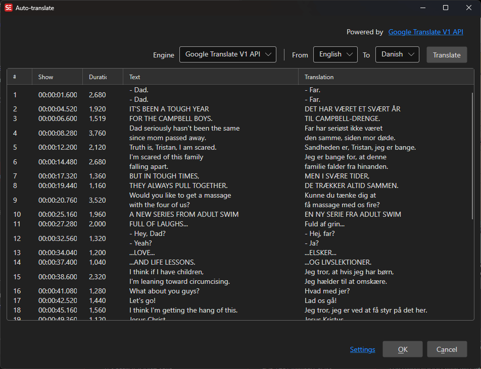

# Auto Translate

Automatically translate subtitles using various translation engines and AI services.

- **Menu:** Auto translate → Auto translate...
- **Shortcut:** Configurable

<!-- Screenshot: Auto translate window -->

## How to Use

1. Open **Auto translate → Auto translate...**
2. Select a translation engine
3. Select the source and target languages
4. Click **Translate** to start
5. Review the translations in the grid
6. Click **OK** to apply

## Supported Engines

- **Google Translate (V1)** — Free Google Translate
- **Google Translate (V2)** — Google Cloud Translation (requires API key)
- **Microsoft Translator** — Azure Cognitive Services (requires API key)
- **DeepL** — DeepL translation (requires API key)
- **Libre Translate** — Open-source, self-hosted translation
- **MyMemory** — Free translation memory
- **Ollama** — Local LLM-based translation
- **Anthropic Claude** — AI translation (requires API key)
- **OpenAI ChatGPT** — AI translation (requires API key)
- **Groq** — AI translation (requires API key)
- **LM Studio** — Local LLM translation

## Engine Configuration

Depending on the selected engine, you may need to provide:

- **API Key** — Authentication key for cloud services
- **API URL** — Custom endpoint URL (for self-hosted services)
- **Model** — Specific model to use (for AI engines)

## Translation Review

The translation grid shows the original text alongside the translated text. You can edit individual translations before accepting them.

## Keyboard Shortcuts

| Key | Action |
|-----|--------|
| Escape | Close / Cancel |
| F1 | Open help |
