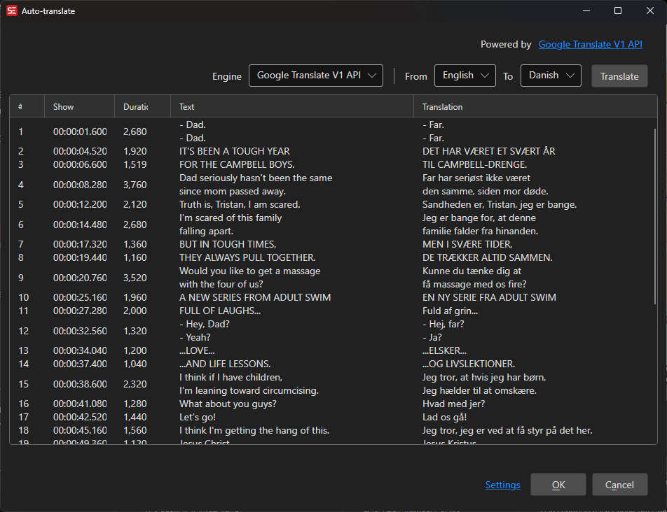

# Auto Translate

Automatically translate subtitles using various translation engines and AI services.

- **Menu:** Translate → Auto-translate...
- **Shortcut:** Configurable

<!-- Screenshot: Auto translate window -->

## How to Use

1. Open **Translate → Auto-translate...**
2. Select a translation engine
3. Select the source and target languages
4. Click **Translate** to start
5. Review the translations in the grid
6. Click **OK** to apply

## Supported Engines

- **Google Translate V1 API** — Free Google Translate
- **Google Translate V2 API** — Google Cloud Translation (requires API key)
- **Bing Microsoft Translator** — Azure Cognitive Services (requires API key)
- **DeepL V2 translate** — DeepL translation (requires API key)
- **LibreTranslate** — Open-source, self-hosted translation
- **MyMemory Translate** — Free translation memory
- **ChatGPT** — OpenAI AI translation (requires API key)
- **LM Studio (local LLM)** — Local LLM translation
- **Ollama (local LLM)** — Local LLM-based translation
- **llama.cpp (local LLM)** — Server-managed local LLM translation; Subtitle Edit downloads llama.cpp and a curated model (TranslateGemma, Qwen or Aya Expanse) and runs a local `llama-server` for you. See [Using your own model](#llamacpp-using-your-own-model) to run a model we don't ship, such as TranslateGemma 27B
- **OpenAI Compatible API** — Generic engine for any service exposing an OpenAI-compatible `chat/completions` endpoint (vLLM, KoboldCpp, a llama.cpp server on another machine, cloud providers, ...); configure URL, model, prompt, and an optional API key
- **Anthropic Claude** — AI translation (requires API key)
- **Groq** — AI translation (requires API key)
- **OpenRouter** — AI translation (requires API key)
- **Lara** — AI translation (requires API key)
- **Perplexity** — AI translation (requires API key)
- **Google Gemini** — AI translation (requires API key)
- **NVIDIA** — AI translation (requires API key)
- **Mistral AI Translate** — AI translation (requires API key)
- **DeepSeek** — AI translation (requires API key)
- **Papago Translate** — Naver Papago translation (requires API key)
- **thammegowda-nllb-serve** — Self-hosted NLLB (No Language Left Behind) server
- **winstxnhdw-nllb-api** — NLLB (No Language Left Behind) API
- **Baidu Translate** — Baidu translation (requires App ID and secret)
- **CrispASR MADLAD** — Local MADLAD-based translation with downloadable models (shown with size and install status); also available in Batch Convert

## llama.cpp: using your own model

The models offered in the download list are deliberately kept small enough to run on an ordinary
machine (around 8 GB or less). You are not limited to them — larger models such as TranslateGemma
27B work fine if your hardware can handle them.

Two ways to use one:

1. **Drop a `.gguf` into the models folder.** Copy the file into Subtitle Edit's `llama.cpp/models`
   folder and it appears in the model list marked *(custom)*. Subtitle Edit recognizes the model
   family from the file name and starts `llama-server` with the right chat template, so a
   self-downloaded TranslateGemma or Qwen quant behaves like the curated ones.
2. **Run your own server.** Tick **Use remote server** and point Subtitle Edit at any
   `llama-server` you started yourself (the default is `http://localhost:8080/v1/chat/completions`).
   Subtitle Edit then does no model management at all.

Be aware of what a bigger model costs. TranslateGemma 27B at Q4_K_M is roughly a 16 GB download and
needs about 20 GB of VRAM to run fully on the GPU — a 24 GB card in practice. Google's own figures
put the 12B ahead of the Gemma 3 27B baseline, so the 12B in the download list is already a strong
choice and the jump to 27B buys less than the size difference suggests.

## Engine Configuration

Depending on the selected engine, you may need to provide:

- **API Key** — Authentication key for cloud services
- **API URL** — Custom endpoint URL (for self-hosted services)
- **Model** — Specific model to use (for AI engines)

## Translation Review

The translation grid shows the original text alongside the translated text. You can edit individual translations before accepting them.

## Keyboard Shortcuts

| Key | Action |
|-----|--------|
| Escape | Close / Cancel |
| F1 | Open help |
