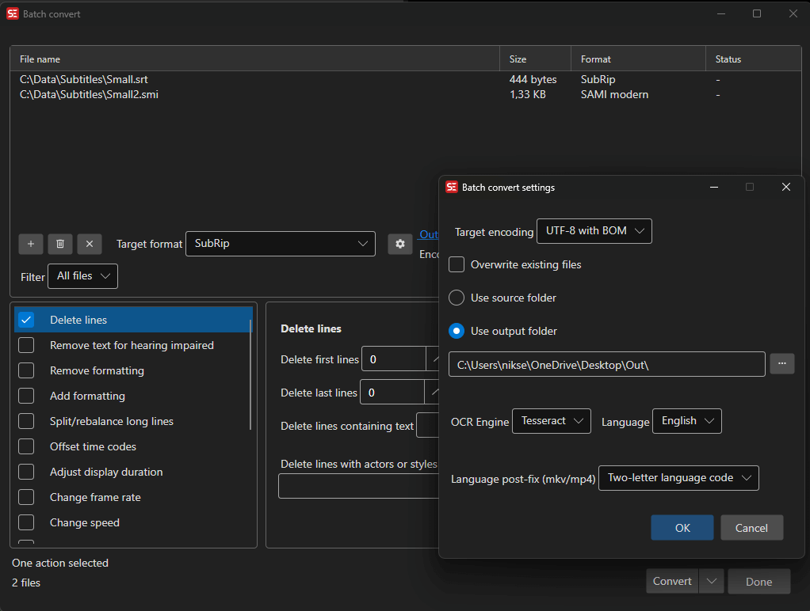

# Batch Convert

Convert multiple subtitle files between formats and apply various transformations.

- **Menu:** Tools → Batch convert...

<!-- Screenshot: Batch convert window -->

## How to Use

1. Open **Tools → Batch convert...**
2. Add subtitle files (drag and drop or use the Add button)
3. Select the output format
4. Optionally add conversion functions (fixes, adjustments)
5. Choose an output folder
6. Click **Convert**

## Available Functions

You can chain multiple conversion functions:
- Fix common errors
- Remove text for hearing impaired
- Multiple replace
- Change casing
- Change formatting (add/remove)
- Offset time codes
- Adjust duration
- Change speed/frame rate
- Bridge gaps
- Apply minimum gap
- Merge lines with same text
- Merge lines with same time codes
- Split/break long lines
- Auto translate
- Delete lines

## Settings

- **Output format** — Choose from 300+ subtitle formats
- **Output folder** — Where converted files are saved
- **Overwrite existing** — Whether to overwrite files
- **Encoding** — Text encoding for output files
