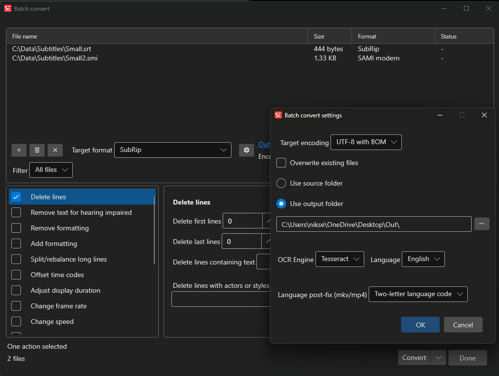

# Batch Convert

Convert multiple subtitle files between formats and apply various transformations.

- **Menu:** Tools → Batch convert...

<!-- Screenshot: Batch convert window -->

## How to Use

1. Open **Tools → Batch convert...**
2. Add subtitle files (drag and drop or use the Add button)
3. Select the output format
4. Optionally add conversion functions (fixes, adjustments)
5. Choose an output folder
6. Click **Convert**

## Available Functions

You can chain multiple conversion functions:
- Fix common errors
- Remove text for hearing impaired
- Multiple replace
- Change casing
- Change formatting (add/remove)
- Offset time codes
- Adjust duration
- Change speed/frame rate
- Bridge gaps
- Apply minimum gap
- Merge lines with same text
- Merge lines with same time codes
- Split/break long lines
- Auto translate
- Delete lines

## OCR in Batch Convert

Batch Convert can OCR image-based subtitle files while converting them to text-based formats.

Supported OCR workflows include:

- Tesseract
- nOCR
- Binary OCR
- Ollama OCR
- PaddleOCR

Subtitle Edit 5 can auto-detect language and pixels-are-space settings for nOCR/Binary OCR in many batch workflows. This reduces the amount of manual setup needed when converting many image-based subtitle files with similar fonts.

## Speech to Text in Batch Mode

Speech-to-text batch mode can transcribe multiple media files and save the results next to the source files. See [Speech to Text](speech-to-text.md) for engine setup and model details.

## Settings

- **Output format** — Choose from 300+ subtitle formats
- **Output folder** — Where converted files are saved
- **Overwrite existing** — Whether to overwrite files
- **Encoding** — Text encoding for output files

For headless batch conversion, see [Command Line (seconv)](../reference/command-line.md).
