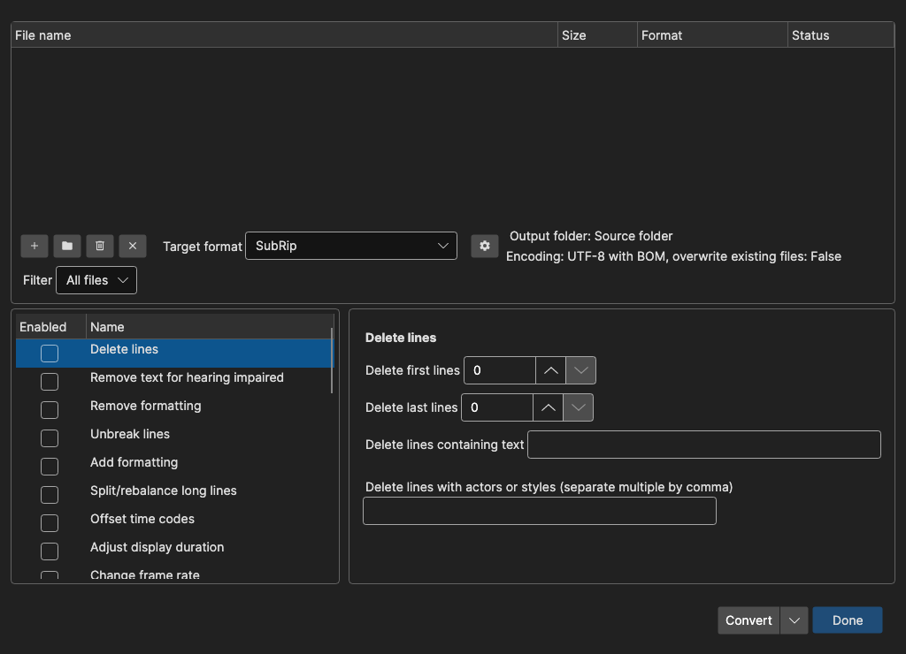

# Batch Convert

Convert multiple subtitle files between formats and apply various transformations.

- **Menu:** Tools → Batch convert...

<!-- Screenshot: Batch convert window -->

## How to Use

1. Open **Tools → Batch convert...**
2. Add subtitle files (drag and drop, or use the Add button). The folder button adds every subtitle file in a folder — drag and drop works with folders too. Turn on **Include subfolders when adding a folder** in the settings (gear button) to scan the whole tree; a scan of a large tree or a network share can be cancelled while it runs.
3. Select the output format
4. Optionally add conversion functions (fixes, adjustments)
5. Choose an output folder
6. Click **Convert**

## Available Functions

You can chain multiple conversion functions:
- Fix common errors
- Remove text for hearing impaired
- Multiple replace
- Change casing
- Change formatting (add/remove)
- Offset time codes
- Adjust duration
- Change speed/frame rate
- Beautify time codes — align cues to frames and apply the [Beautify time codes](beautify-time-codes.md) profile rules; frame rate and shot changes are read from a video file with the same name as the subtitle file, if one is found
- Snap all times to frames — round every start and end time to the nearest frame, using the frame rate of a video file with the same name as the subtitle file or a fixed frame rate you choose
- Convert colors to dialog — turn a color change inside a cue into a dash-prefixed dialog, optionally removing the color tags, adding new lines and re-breaking the lines
- Bridge gaps
- Apply minimum gap
- Merge lines with same text
- Merge lines with same time codes
- Split/break long lines
- Auto translate
- Delete lines

## Auto-translate in Batch Convert

Batch Convert can machine-translate files as part of the conversion. Supported engines:

- Ollama
- LibreTranslate
- LM Studio
- llama.cpp — fully managed: Batch Convert reuses an already-running local `llama-server`, or downloads llama.cpp plus a curated translation model (e.g. TranslateGemma) and starts the server for you. Point it at your own server via the remote-server option in [Auto-translate](auto-translate.md) settings.
- NLLB (nllb-serve and nllb-api)
- DeepL (API key required)
- CrispASR MADLAD

The same feature is available headlessly in `seconv` via `--translate-to` — see the [command line documentation](../reference/command-line.md).

## OCR in Batch Convert

Batch Convert can OCR image-based subtitle files while converting them to text-based formats.

Supported OCR engines in Batch Convert:

- nOcr
- BinaryOcr
- Tesseract
- Ollama
- llama.cpp (curated OCR vision models — GLM-OCR, LightOnOCR, PaddleOCR-VL; a local `llama-server` is started automatically)
- PaddleOCR (Windows and Linux only)

Subtitle Edit 5 can auto-detect language and pixels-are-space settings for nOcr/BinaryOcr in many batch workflows. This reduces the amount of manual setup needed when converting many image-based subtitle files with similar fonts.

## Speech to Text in Batch Mode

Speech-to-text batch mode can transcribe multiple media files and save the results next to the source files. See [Speech to Text](speech-to-text.md) for engine setup and model details.

## Settings

- **Output format** — Choose from 380+ subtitle formats
- **Output folder** — Where converted files are saved
- **Overwrite existing** — Whether to overwrite files
- **Encoding** — Text encoding for output files

For headless batch conversion, see [Command Line (seconv)](../reference/command-line.md).
