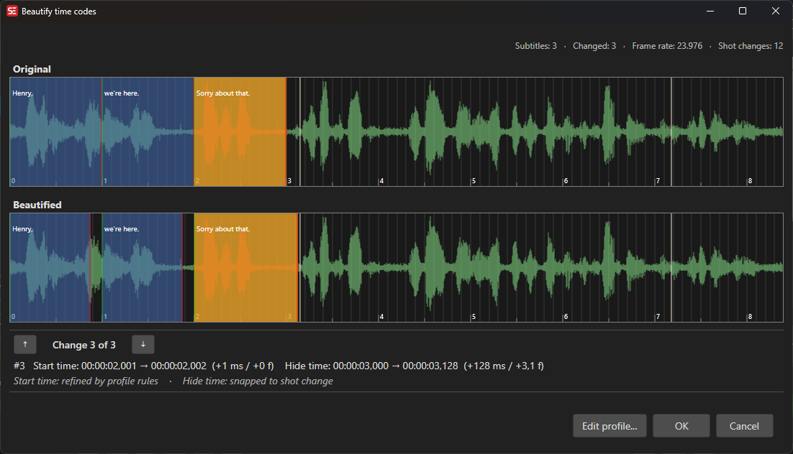

# Beautify Time Codes

Snap subtitle in- and out-cues to shot changes, frame boundaries, and minimum-gap / duration rules in one pass, using a fully configurable profile.

- **Menu:** Tools → Beautify time codes…
- **Profile editor:** Options → Settings → Waveform → gear icon next to *Snap to shot changes*, or *Edit beautify time codes profile…* button inside the tool window.

<!-- Screenshot: Beautify time codes window with Original/Beautified visualizers -->

## Tool window

The window shows the loaded subtitle in two stacked waveform visualizers:

- **Original** — the subtitles as they are now.
- **Beautified** — the result of applying the current profile. This view updates live every time the profile changes.

Above the visualizers a stats line summarises the run:

> Subtitles: N · Changed: M · Frame rate: 25 · Shot changes: K

Below the visualizers, the **change navigator** lets you step through every cue the beautify pass moved:

- **▲ / ▼** — previous / next change. Both visualizers center on the change.
- **Change X of Y** — position counter.
- **Detail line** — `#15   Start: 00:01:23,456 → 00:01:23,400  (−56 ms / −1.4 f)    End: …`
- **Reason line** — italic, dimmed: explains *why* the cue moved, per side:
  - `Start: snapped to shot change`
  - `End: snapped to frame`
  - `Start: min. gap enforced` — start landed exactly on previous end + min. gap.
  - `End: min. gap enforced` — end landed exactly on next start − min. gap.
  - `Duration: min. duration enforced` / `max. duration enforced` — duration was clamped to the *Subtitle min/max display milliseconds* general setting.
  - `—` when no reason is detected (e.g. chaining / connected-subtitle adjustments).

Press **OK** to apply the beautified cues to the subtitle, or **Cancel** to discard.

## Profile editor

The profile editor controls *exactly* how cues are moved. It is independent of which subtitle is loaded, and persists across Subtitle Edit restarts via the main `Settings.json`.

### Presets

Load a known-good configuration from the **Load preset** menu at the bottom of the dialog:

- **Default** — sensible general defaults.
- **Netflix** — matches Netflix's *Timed Text Style Guide* timing rules (2-frame min. gap, 12-frame green zones around shot changes, *Extend until shot change* chaining).
- **SDI** — for SDI-style broadcast work (4-frame gap, larger zones).

Presets overwrite all profile values. Use them as a starting point.

### General

- **Gap** — the project-wide minimum gap, in **frames**. Changing this value also rewrites all per-section gap fields below that are currently non-zero, so a custom value in one place doesn't silently disagree with the global.

### In cues / Out cues

For a paragraph in-cue (start) or out-cue (end), the profile defines a *snap window* around the nearest shot change:

- **Gap** — for out-cues, how far before a shot change the cue should be placed (in frames). For in-cues this is 0 by default (start on the shot change).
- **Zones** — four numeric fields, left-to-right:
  - **Left green** — soft, advisory zone before the shot change.
  - **Left red** — hard snap zone before the shot change. A cue dragged into this range snaps to the shot change.
  - **Right red** — hard snap zone after the shot change.
  - **Right green** — soft, advisory zone after the shot change.

The preview to the right of each section shows the current setup: gray gap area, red and green zones around the center line (the shot change), and the two subtitle blocks pressed up against the gap.

### Connected subtitles

When two consecutive subtitles are *connected* (separated by less than **Treat as connected if gap smaller than** milliseconds), the beautifier preserves their relationship instead of treating each cue independently. The same zone logic applies, but with separate gap values depending on whether the **in cue** or **out cue** is closer to the shot change. Use the inner tab control to switch between the two cases.

### Chaining

When two consecutive subtitles *almost* touch but a shot change sits between them, the beautifier can chain them — extending one to meet the other — based on the **General**, **In cue on shot change**, and **Out cue on shot change** sub-tabs.

Each sub-tab offers:

- **Max gap** (radio) / **Zones** (radio) — choose whether to gate the chaining by an absolute gap budget in milliseconds, or by frame-based zones identical to the In/Out cue zones.
- **If there is a shot change in between** (General tab only) — controls the behavior across a shot change:
  - **Don't chain** — leave the gap untouched.
  - **Extend across shot change** — let the previous cue cross the shot.
  - **Extend until shot change** — extend up to the shot, but not past it. *(Netflix preset default.)*
- **Apply 'general' chaining rules too** (In/Out tabs) — also apply the General tab's chaining rules to this scenario.

## Snap-to-shot-changes while editing

The profile's **In cues / Out cues red zones** also drive the snap distance when you drag a paragraph edge in the main waveform:

- Drag a paragraph start into the red zone around a shot change → snaps to the shot change.
- Drag a paragraph end into the red zone → snaps to one frame **before** the shot change (so the cue doesn't bleed onto the next shot).
- **Hold Shift while dragging** to bypass the snap entirely.

Toggle the whole behavior with *Snap to shot changes (hold Shift to override)* in Options → Settings → Waveform.

## Related

- [Shot Changes](shot-changes.md) — detecting and importing the shot-change list that this tool relies on.
- [Audio Visualizer](audio-visualizer.md) — the waveform editor where snap-to-shot-changes happens during normal editing.
