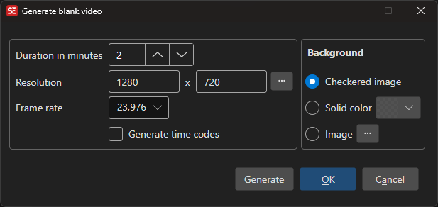

# Blank Video

Generate a blank video file for testing or subtitle preview purposes.

- **Menu:** Video → Generate blank video...
- **Shortcut:** Configurable

<!-- Screenshot: Blank video window -->

## How to Use

1. Open **Video → Generate blank video...**
2. Set the video resolution (width × height)
3. Select a frame rate
4. Set the duration in minutes
5. Choose a background type
6. Click **Generate**

## Background Options

- **Checked image** — Classic checkered pattern (useful for transparency testing)
- **Solid color** — A single flat color background
- **Background image** — Use a custom image file as the background

## Additional Options

- **Generate time codes** — Burn time code display into the video
- **Use source resolution** — Match resolution from an existing video

## Batch Mode

Multiple blank videos can be queued as jobs for batch generation.

## Keyboard Shortcuts

| Key | Action |
|-----|--------|
| Escape | Close / Cancel |
| F1 | Open help |
