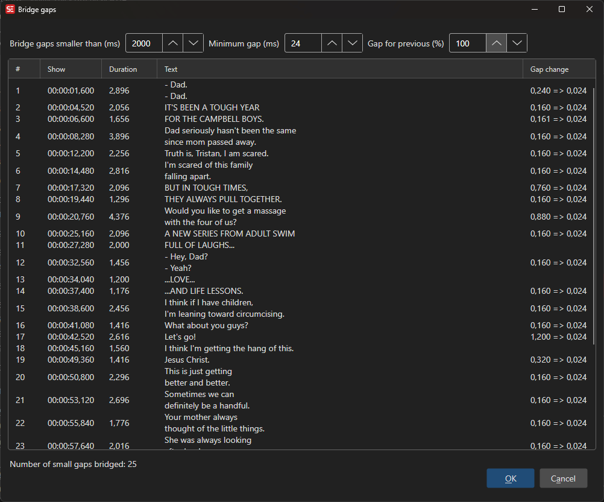

# Bridge Gaps

Extend subtitle durations to fill gaps between consecutive subtitles.

- **Menu:** Tools → Bridge gaps...

<!-- Screenshot: Bridge gaps window -->

## Options

- **Maximum gap to bridge** — Only bridge gaps smaller than this value
- **Minimum gap after bridge** — Maintain at least this much gap
- **Extend previous subtitle** — Extend the end of the previous subtitle
- Preview affected lines before applying
