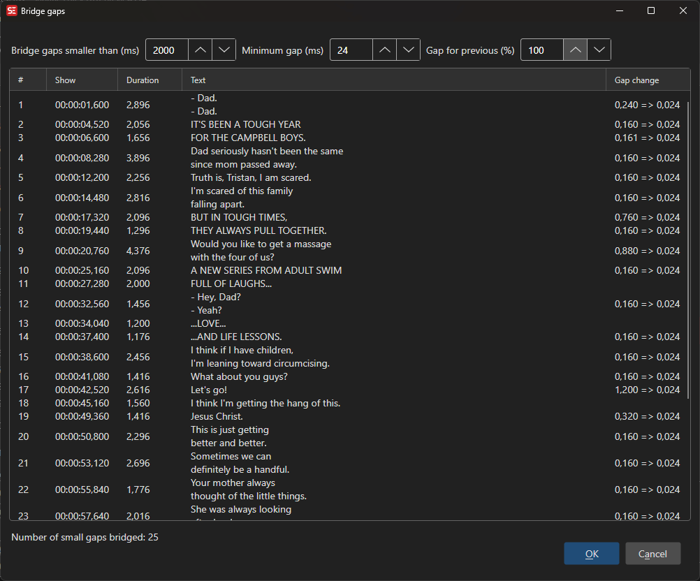

# Bridge Gaps

Extend subtitle durations to fill gaps between consecutive subtitles.

- **Menu:** Tools → Bridge gaps...

<!-- Screenshot: Bridge gaps window -->

## Options

- **Bridge gaps smaller than** — Only bridge gaps smaller than this value
- **Min. gap** — Keep at least this much gap between the bridged subtitles
- **Percent for previous** — How much of the gap is given to the previous subtitle (the rest goes to the next subtitle)

Values are entered in milliseconds, or in frames when the global *Use time format HH:MM:SS:FF* setting is enabled. The preview updates live and the status text shows the number of bridged gaps.
