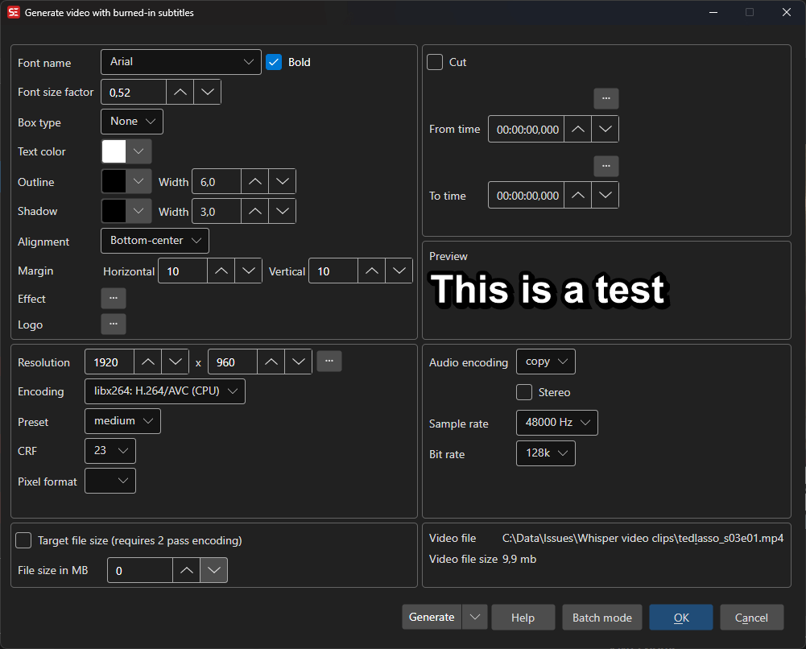

# Burn-In Subtitles

Hardcode (burn-in) subtitles permanently into a video file using FFmpeg.

- **Menu:** Video → Burn-in subtitles...
- **Shortcut:** Configurable

<!-- Screenshot: Burn-in subtitles window -->

## How to Use

1. Open **Video → Burn-in subtitles...**
2. Select or confirm the video file
3. Configure font settings (name, size, colors, outline, shadow)
4. Configure video encoding settings (encoder, preset, CRF, pixel format)
5. Configure audio settings (encoder, sample rate, bit rate, stereo)
6. Select an output folder
7. Click **Generate** to start encoding

## Font Settings

- **Font name** — Select the subtitle font
- **Font factor** — Scale the font size relative to video resolution
- **Bold** — Use bold font weight
- **Outline** — Outline thickness and color
- **Shadow** — Shadow width and color
- **Box type** — Subtitle box style (none, opaque box, outline)
- **Text color** — Subtitle text color
- **Box color** — Background box color
- **Alignment** — Subtitle alignment position
- **Margins** — Horizontal and vertical margin offsets
- **Fix RTL** — Fix right-to-left text rendering

## Video Settings

- **Resolution** — Output video width and height
- **Encoding** — Video codec (H.264, H.265, VP9, etc.)
- **Pixel format** — Output pixel format
- **Preset** — Encoding speed/quality preset
- **CRF** — Constant Rate Factor (quality level)

## Audio Settings

- **Encoding** — Audio codec
- **Sample rate** — Audio sample rate
- **Bit rate** — Audio bit rate
- **Stereo** — Stereo or mono output

## Batch Mode

Multiple video/subtitle pairs can be queued as jobs for batch processing.

## Keyboard Shortcuts

| Key | Action |
|-----|--------|
| Escape | Close / Cancel |
| F1 | Open help |
