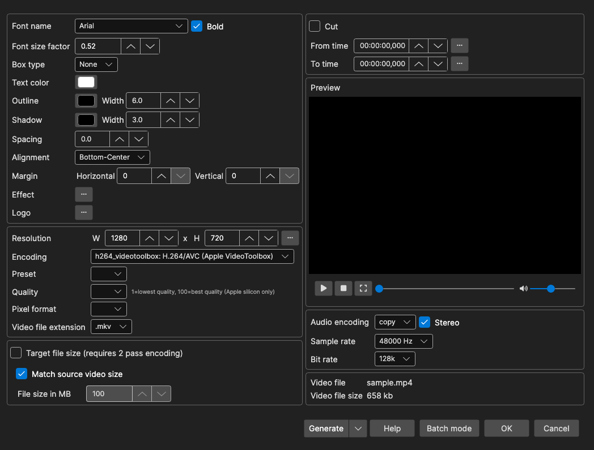

# Burn-In Subtitles

Hardcode (burn-in) subtitles permanently into a video file using FFmpeg.

- **Menu:** Video → Generate video with burned-in subtitles...
- **Shortcut:** Configurable

<!-- Screenshot: Burn-in subtitles window -->

## How to Use

1. Open **Video → Generate video with burned-in subtitles...**
2. Select or confirm the video file
3. Configure font settings (name, size, colors, outline, shadow)
4. Configure video encoding settings (encoder, preset, CRF, pixel format)
5. Configure audio settings (encoder, sample rate, bit rate, stereo)
6. Select an output folder
7. Click **Generate** to start encoding

## Font Settings

- **Font name** — Select the subtitle font
- **Font factor** — Scale the font size relative to video resolution
- **Bold** — Use bold font weight
- **Outline** — Outline thickness and color
- **Shadow** — Shadow width and color
- **Box type** — Subtitle box style (none, opaque box, outline)
- **Text color** — Subtitle text color
- **Box color** — Background box color
- **Alignment** — Subtitle alignment position
- **Margins** — Horizontal and vertical margin offsets
- **Fix RTL** — Fix right-to-left text rendering

## Video Settings

- **Resolution** — Output video width and height
- **Encoding** — Video codec (H.264, H.265, VP9, etc.)
- **Pixel format** — Output pixel format
- **Preset** — Encoding speed/quality preset
- **CRF** — Constant Rate Factor (quality level)

## Hardware Acceleration

Besides the CPU encoders (`libx264`, `libx265`, `libvpx-vp9`, `prores_ks`), the encoding list
offers the GPU encoders available on your platform. GPU encoding is much faster than CPU
encoding, at somewhat lower quality per bit — for the same visual quality a GPU encoder
produces a larger file.

Only encoders that can actually run on the current operating system are listed, so the choices
differ between Windows/Linux and macOS.

### Windows and Linux

| Encoder | Hardware | Quality setting |
|---------|----------|-----------------|
| `h264_nvenc` / `hevc_nvenc` | NVIDIA GPU | **CQ** 0–51 (lower is better) |
| `h264_amf` / `hevc_amf` | AMD GPU | **Quality** 0–10 (lower is better) |
| `h264_qsv` / `hevc_qsv` | Intel Quick Sync | **CRF** (lower is better) |

NVENC takes its own preset list (`p1`–`p7`, `hq`, `ll`, …) instead of the x264 presets. AMF has
no preset. Quality is left blank by default, which lets FFmpeg pick a bitrate.

All HEVC output is tagged `hvc1` so it plays in QuickTime and other Apple players, which reject
the `hev1` tag FFmpeg writes by default.

### macOS (Apple VideoToolbox)

| Encoder | Hardware | Quality setting |
|---------|----------|-----------------|
| `h264_videotoolbox` | Apple silicon / Intel Mac media engine | **Quality** 1–100 (higher is better) |
| `hevc_videotoolbox` | Apple silicon / Intel Mac media engine | **Quality** 1–100 (higher is better) |
| `prores_videotoolbox` | Apple silicon media engine | Profile only |

Notes:

- VideoToolbox has no preset — the **Preset** list is empty for these encoders.
- Quality runs the opposite way from CRF: **higher is better**, and it replaces CRF entirely.
- The **Quality** setting requires Apple silicon. On Intel Macs FFmpeg reports
  *"qscale not available for encoder"*; leave Quality blank there and use two-pass/bitrate
  instead. Quality is blank by default, so encoding works out of the box on both.
- `prores_videotoolbox` uses the same profiles as `prores_ks` (proxy, lt, standard, hq, 4444,
  4444xq) and is far faster than the CPU ProRes encoder.
- Two-pass encoding is not supported by VideoToolbox.

Hardware encoders depend on the FFmpeg build in use. If an encoder fails immediately, run
`ffmpeg -encoders` and check that it is listed; on macOS the Homebrew and official FFmpeg
builds all include VideoToolbox.

## Audio Settings

- **Encoding** — Audio codec
- **Sample rate** — Audio sample rate
- **Bit rate** — Audio bit rate
- **Stereo** — Stereo or mono output

## Batch Mode

Multiple video/subtitle pairs can be queued as jobs for batch processing.

## Keyboard Shortcuts

| Key | Action |
|-----|--------|
| Escape | Close / Cancel |
| F1 | Open help |
