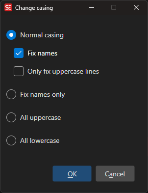
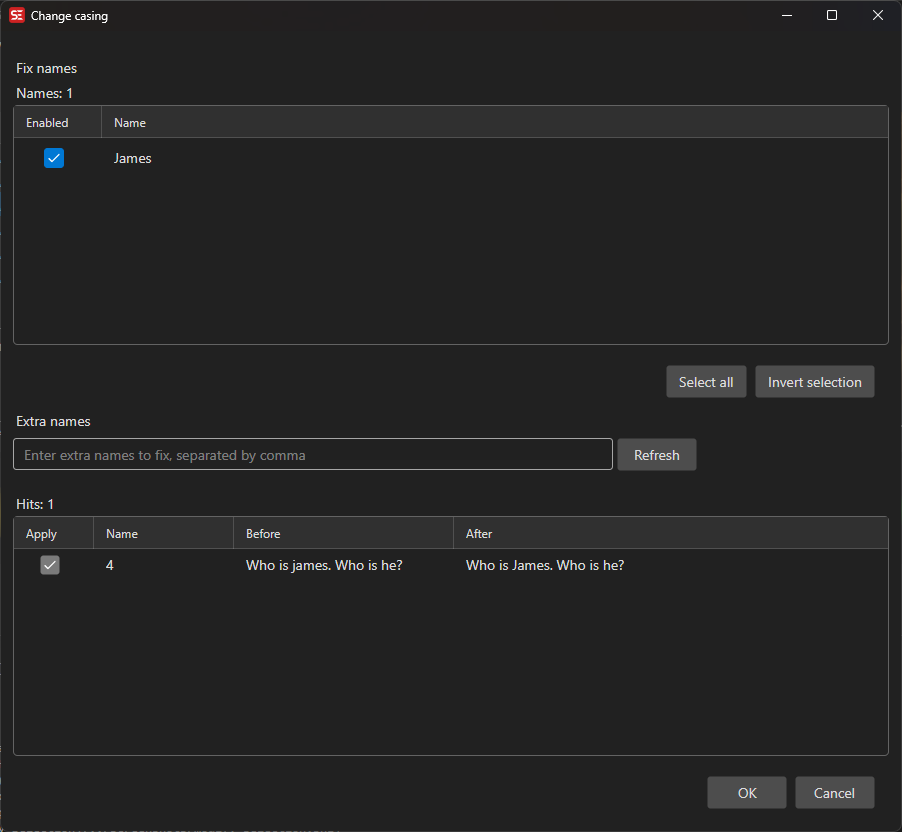

# Change Casing

Fix the casing (capitalization) of subtitle text.

- **Menu:** Tools → Change casing...

<!-- Screenshot: Change casing window -->

## Options

- **Normal casing** — Capitalize first letter of each sentence
- **Fix names** — Capitalize proper names (using a names list)
- **All uppercase** — Convert all text to uppercase
- **All lowercase** — Convert all text to lowercase

## Fix Names

The Fix Names feature uses a customizable list of proper names to ensure correct capitalization.

<!-- Screenshot: Fix names window -->

