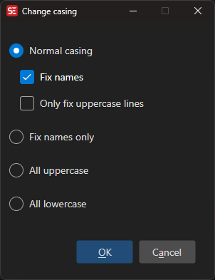
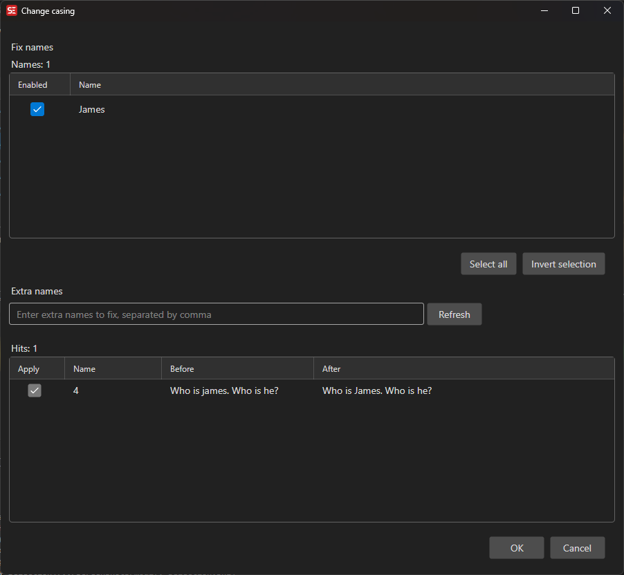

# Change Casing

Fix the casing (capitalization) of subtitle text.

- **Menu:** Tools → Change casing...

<!-- Screenshot: Change casing window -->

## Options

- **Normal casing** — Capitalize first letter of each sentence
  - **Fix names** — Also capitalize proper names using a names list
  - **Only fix uppercase lines** — Only apply the change to lines that are entirely uppercase
- **Fix names only** — Only fix the casing of proper names; leave other text untouched
- **All uppercase** — Convert all text to uppercase
- **All lowercase** — Convert all text to lowercase

## Fix Names

When **Fix names** (or **Fix names only**) is selected, a follow-up window lists the proposed name fixes so you can include or exclude individual items before applying.

<!-- Screenshot: Fix names window -->

