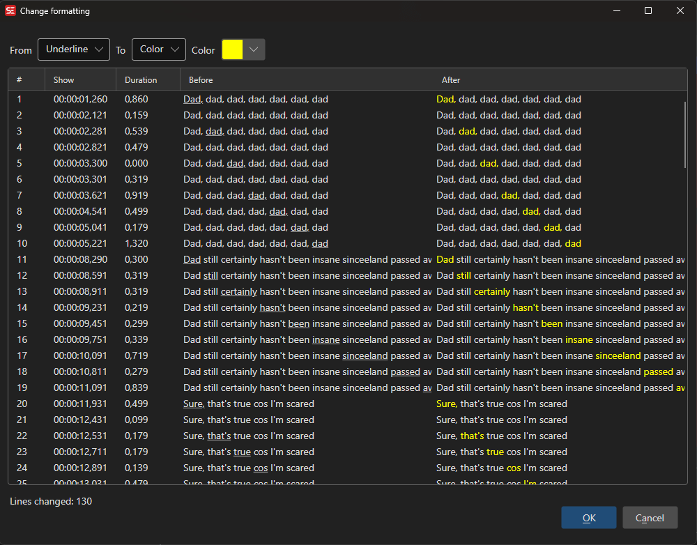

# Change Formatting

Add or remove formatting (bold, italic, underline, etc.) from subtitle text.

- **Menu:** Tools → Change formatting...

<!-- Screenshot: Change formatting window -->

## Options

- **Remove formatting** — Strip selected formatting types
- **Add formatting** — Apply formatting to all selected lines
- Supports italic, bold, underline, and other formatting tags
