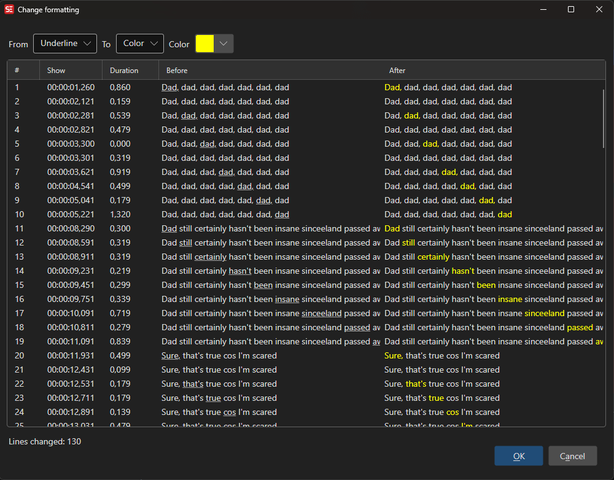

# Change Formatting

Add or remove formatting (bold, italic, underline, etc.) from subtitle text.

- **Menu:** Tools → Change formatting...

<!-- Screenshot: Change formatting window -->

## Options

- **From** — The formatting type to convert from: Italic, Bold, Underline, or Color
- **To** — The formatting type to convert to: Italic, Bold, Underline, or Color
- **Color** — When *To* is Color, the color to apply (color picker)

All matching subtitles are shown in a preview list with **Before** and **After** columns before any changes are applied.
