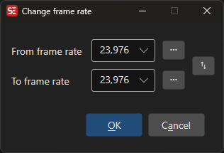

# Change Frame Rate

Convert subtitle timings from one frame rate to another.

- **Menu:** Sync → Change frame rate...

<!-- Screenshot: Change frame rate window -->

## Common Frame Rates

- 23.976 (NTSC Film)
- 24 (Film)
- 25 (PAL)
- 29.97 (NTSC)
- 30
- 50 (PAL interlaced)
- 59.94 (NTSC interlaced)
