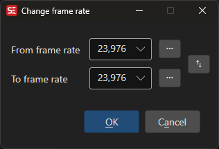

# Change Frame Rate

Convert subtitle timings from one frame rate to another.

- **Menu:** Synchronization → Change frame rate...

<!-- Screenshot: Change frame rate window -->

## Common Frame Rates

- 23.976 (NTSC Film)
- 24 (Film)
- 25 (PAL)
- 29.97 (NTSC)
- 30
- 50 (PAL interlaced)
- 59.94 (NTSC interlaced)
- 60

## Options

- **Video line** — When a video is open, the top of the window shows its file name and detected frame rate (hover for the full path)
- **From frame rate** — Preset to the current frame rate (the toolbar value, which follows the open video), as in Subtitle Edit 4: a subtitle taken from a video was made at that video's frame rate
- **To frame rate** — Remembers the last used value; if it equals the from rate, the PAL/NTSC-film counterpart (25 ↔ 23.976) is suggested instead
- **From frame rate** / **To frame rate** — Pick from the list, or click the browse button next to either to choose a video file; its frame rate is read and selected
- The swap button exchanges the from and to values
- **OK** applies the conversion; **Cancel** closes without changes

The window remembers its size and position between sessions.
