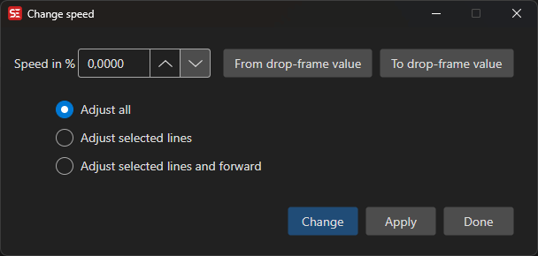

# Change Speed

Adjust subtitle timings for videos with different playback speeds.

- **Menu:** Sync → Change speed...

<!-- Screenshot: Change speed window -->

## Use Cases

- Converting between PAL (25fps) and NTSC (23.976fps) video speeds
- Adjusting for speed-up or slow-down transfers
