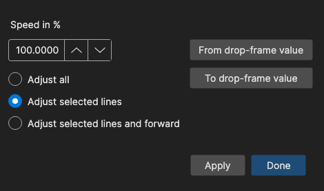

# Change Speed

Adjust subtitle timings for videos with different playback speeds.

- **Menu:** Synchronization → Change speed...

<!-- Screenshot: Change speed window -->

## Use Cases

- Converting between PAL (25fps) and NTSC (23.976fps) video speeds
- Adjusting for speed-up or slow-down transfers

## Options

- **Speed in %** — 1 to 1000 (default 100)
- **From drop-frame value** — Sets the speed to 100.1001
- **To drop-frame value** — Sets the speed to 99.9001
- **Adjust all** / **Adjust selected lines** / **Adjust selected lines and forward** — Which lines are changed (the selection options need lines selected in the main window)
- **Apply** applies the change to the subtitle; **Done** closes the window

The window remembers its size and position between sessions.
