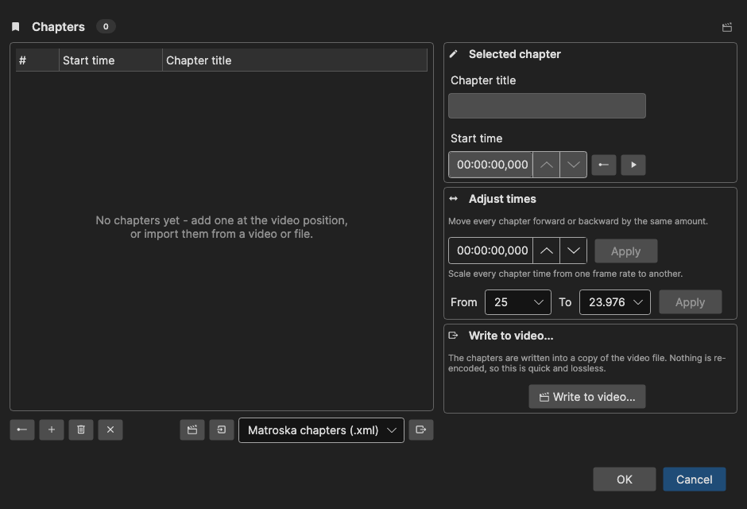

# Chapters

Edit the chapter marks of the loaded video: add them at the video position, import them from the video or a file, export them, and write them back into the video file.

- **Menu:** Video → More → Chapters...
- **Shortcut:** Configurable

<!-- Screenshot: Chapters window -->

Chapters belong to the video, not to the subtitle, so a video must be loaded. Chapters are drawn on the [audio visualizer](audio-visualizer.md) as labelled marks, which makes them useful as landmarks while subtitling even if you never write them back to the video.

## How to Use

1. Open the video, then **Video → More → Chapters...**
2. Add chapters at the video position, or import the ones the video already has
3. Rename a chapter and adjust its start time in the **Selected chapter** panel on the right
4. Click **OK** to keep the list

The list shows **#**, **Start time** and **Chapter title**, sorted by time. **Go to** moves the video to the selected chapter.

## Adding and Editing

- **Add chapter at video position** — Adds a chapter where the video is right now, named *Chapter n*
- **Add chapter** — Adds a chapter without using the video position
- **Delete** / **Clear** — Remove the selected chapter, or all of them (both ask first)
- **Selected chapter** — Edit the title and the start time; a button sets the start time to the current video position

The waveform's right-click menu has **Toggle chapter at video position**, which adds a chapter at the cursor, or removes the one already there — the quickest way to mark chapters while listening.

## Import

- **Import from video** — Reads the chapters stored in the loaded video file (MP4 stores them in two different ways, and both are read)
- **Import from file...** — Reads Matroska chapter XML, ffmpeg metadata (`.ffmeta`), OGM (`.txt`) and `.ini` chapter files. Anything Subtitle Edit can open as a subtitle also works, so a plain subtitle file can be turned into chapters

Both replace the current list.

## Export

**Export to file...** writes the list in one of four formats — the picker decides the writer, not the extension, because two of them are plain `.txt`:

| Format | Extension |
|--------|-----------|
| Matroska chapters XML | .xml |
| ffmpeg metadata | .ffmeta |
| OGM chapters | .txt |
| YouTube chapters | .txt |

The YouTube form is the timestamped list you paste into a video description.

## Adjust Times

- **Shift all times** — Move every chapter forward or backward by the same amount
- **Change frame rate** — Scale every chapter time from one frame rate to another

## Write to Video

**Write to video...** writes the chapters into a *copy* of the video file. Nothing is re-encoded, so it is quick and lossless. Only MP4 and Matroska can carry chapters; for anything else the button reports that. Pick the output file name — ffmpeg cannot write over the file it is reading, so the suggestion is a sibling file.

## Where Chapters Are Stored

Chapters you edit are saved next to Subtitle Edit's other per-video data (a `.chapters.xml` sidecar in the `Chapters` folder of Subtitle Edit's data folder, named after a hash of the video file), not inside the video. The sidecar is plain Matroska chapter XML, so it can be handed straight to `mkvmerge`.

When a video is opened, the sidecar wins over the chapters inside the container: it only exists because you changed something, and re-reading the video would undo that work. Use **Import from video** to deliberately go back to what the file itself carries.

## Keyboard Shortcuts

| Key | Action |
|-----|--------|
| Escape | Close / Cancel |
| Delete | Delete the selected chapter (in the list) |
