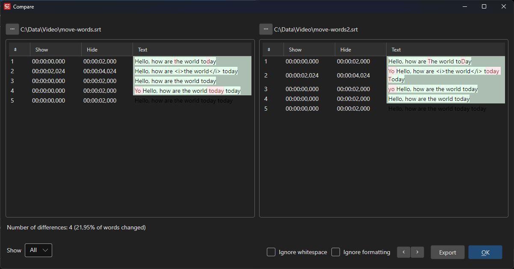

# Compare

Compare two subtitle files side by side to identify differences in text, timing, and formatting.

**Menu:** `File` → `Compare...`

## How to Use

1. Go to **File** → **Compare...** to open the compare dialog.
2. The left panel shows the currently loaded subtitle.
3. Use the file picker on either side (or drag-and-drop) to load a second subtitle file.
4. Differences are highlighted with colors:
   - **Red:** Lines present in only one side (added or removed).
   - **Green:** Cells where the start time, end time, or text differs.
   - **Orange:** Cells where the line number differs.
5. Use **Previous difference** / **Next difference** to jump between differing rows.
6. Use the options and view dropdown to refine the comparison.

## Features

### Comparison Options
- **Ignore formatting:** Compare text only, ignoring formatting tags.
- **Ignore white space:** Ignore differences in whitespace.

### Visual Comparison
- Side-by-side subtitle display with synchronized scrolling.
- Color-coded differences for easy identification.
- View modes: **Show all**, **Show only differences**, **Show only differences in text**.

### Actions
- **Reload right from file:** Reload the right pane from the same file as the left pane (useful for diffing in-memory edits against the saved file).
- **Export:** Export the comparison as an HTML file.

## Keyboard Shortcuts

| Shortcut | Action |
|----------|--------|
| F1 | Show help |
| Escape | Close dialog |
