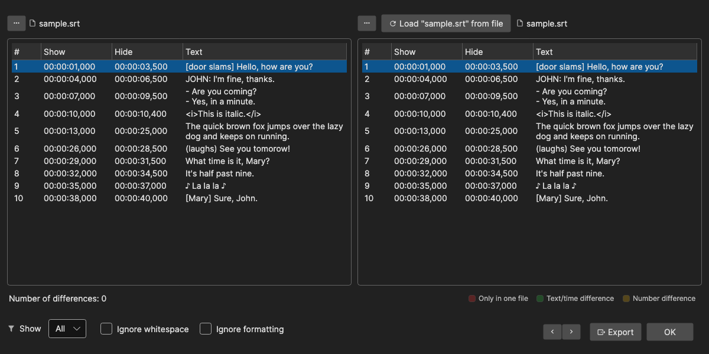

# Compare

Compare two subtitle files side by side to identify differences in text, timing, and formatting.

**Menu:** `File` → `Compare...`

## How to Use

1. Go to **File** → **Compare...** to open the compare dialog.
2. The left side (**Current**) shows the currently loaded subtitle.
3. Use the file picker on either side (or drag-and-drop) to load a second subtitle file as the **Reference** on the right.
4. Each row holds a matching pair of lines, so the two sides always stay aligned. Differences are highlighted with colors:
   - **Red:** Lines present in only one side (added or removed).
   - **Green:** Cells where the start time, end time, or text differs.
   - **Orange:** Cells where the line number differs.
5. Use **Previous difference** / **Next difference** (F8 / Shift+F8) to jump between differing rows, or click the overview strip on the right to jump to any part of the file.
6. Use the tabs (**All**, **Differences**, **Text differences**) and the options to refine the comparison. Each tab shows how many rows it holds.

## Alignment and sync points

Lines are paired by content, not by position. A line that exists on one side only gets a blank row on the other, and the lines after it pair up again, even when the two files are timed differently. Lines with the same or nearly the same text, or with the same timing, are matched.

If the automatic pairing gets a stretch wrong, set a **sync point**:

1. Right-click (Ctrl+Click on macOS) a line on one side and choose **Sync point: use this current line** (or **...reference line**). A bar above the status line says which line is waiting.
2. Select the matching line on the other side and click **Sync** in that bar, or right-click it and choose **Sync with current #N** (or **Sync with reference #N**).

When the current subtitle is editable and the two start times differ, the sync point also fixes the timing. The current line gets the reference line's start time, and the lines after it move by the same amount, up to the next sync point. One sync point on the first line where the timing goes wrong is enough to shift the rest of the file. The shift is a pending change like any other edit, so **Undo** takes it back.

The two lines are now always shown as a pair, marked with a link icon between them, and the lines above and below are aligned separately. You can add as many sync points as you need. A new sync point that contradicts an earlier one replaces it. Right-click a sync point to remove it, or use **Clear sync points**. Press Escape or **Cancel** to drop a half-picked sync point.

## Editing

The current subtitle can be edited right in the compare window. The reference is read-only.

- **Take from reference:** The arrow button between the two sides copies the reference line's text and timing to the current line. For a line that exists only in the reference, it inserts the line into the current subtitle.
- **Delete:** For a line that exists only in the current subtitle, the trash button deletes it.
- **Edit a line:** Double-click a row, press F2, or click the pencil to edit the text and timing inline. **Take text** and **Take timing** copy just one part from the reference.
- **Undo:** Every change can be undone, one step at a time.
- **Apply:** The changes go back to the subtitle when you click **Apply**. **Cancel** discards them.

Editing is only available while the left side is the loaded subtitle. If you load another file on the left, both sides are read-only.

## Features

### Comparison Options
- **Ignore formatting:** Compare text only, ignoring formatting tags.
- **Ignore white space:** Ignore differences in whitespace.
- **Ignore numbering:** Lines that differ only in their number do not count as different.

### Visual Comparison
- Side-by-side subtitle display, one aligned pair per row.
- Color-coded differences for easy identification.
- An overview strip that marks every difference and edit in the whole file.
- View modes: **All**, **Differences**, **Text differences**.

### Actions
- **Reload right from file:** Reload the right pane from the same file as the left pane (useful for diffing in-memory edits against the saved file).
- **Export:** Export the comparison as an HTML file.

## Keyboard Shortcuts

| Shortcut | Action |
|----------|--------|
| F1 | Show help |
| F8 / Shift+F8 | Next / previous difference |
| F2 | Edit the selected line |
| Ctrl+Enter | Save the line being edited |
| Alt+Left | Take the selected line from the reference |
| Delete | Delete the selected current line |
| Ctrl+Z | Undo the last change |
| Escape | Cancel editing or a half-picked sync point, or close the dialog |
