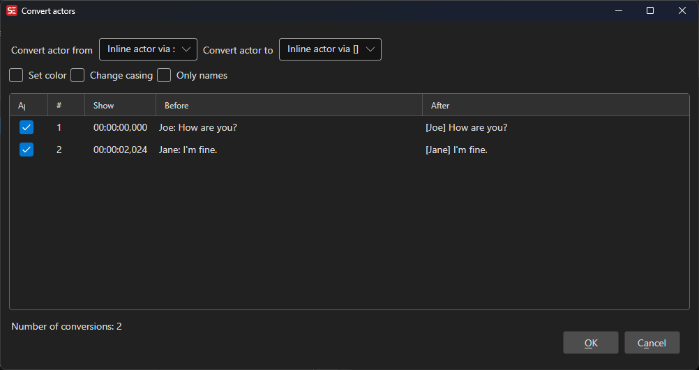

# Convert Actors

Convert actor/voice labels in subtitles from one style to another — for example, from inline `[NAME]` text to the subtitle's dedicated Actor property, or vice versa.

- **Menu:** Tools → Convert actors...

<!-- Screenshot: Convert actors window -->

## Convert From / Convert To

Both dropdowns share the same set of options:

| Option | Example |
|---|---|
| Inline actor via `[]` | `[JOHN] Hello there.` |
| Inline actor via `()` | `(JOHN) Hello there.` |
| Inline actor via `:` | `JOHN: Hello there.` |
| Actor | The subtitle's Actor metadata field |

Select where the actor label currently comes from in **Convert from**, and where it should be placed in **Convert to**.

## Options

### Set color

When enabled, wraps the converted actor label in a color tag using the chosen color.  
For ASS/SSA formats this uses an override tag (`{\c&H...&}`); for other formats it uses an HTML `` tag.

### Change casing

When enabled, applies a casing transformation to the actor label before conversion:

- **Normal casing** — Capitalizes the first letter, lowercases the rest
- **All uppercase** — `JOHN`
- **All lowercase** — `john`
- **Proper case** — Capitalizes each word

### Only names

When enabled, items where the actor label is not recognized as a proper name are shown unchecked in the preview list by default. Items are matched against the built-in names dictionary for the detected language.

## Preview

All proposed conversions are shown in a preview list with **Before** and **After** columns before any changes are applied.

- Check or uncheck individual rows to include or exclude specific conversions.
- The status bar shows the total number of conversions found.

Click **OK** to apply all checked conversions, or **Cancel** to discard all changes.

## Notes

- When converting from a bracketed inline format (e.g. `[]` or `()`) to the **Actor** property, a subtitle line that contains two differently labeled speakers on separate lines will be automatically split into two separate subtitle entries, each with its own Actor value.
- The selected settings (from/to type, color, casing, only names) are saved and restored between sessions.
