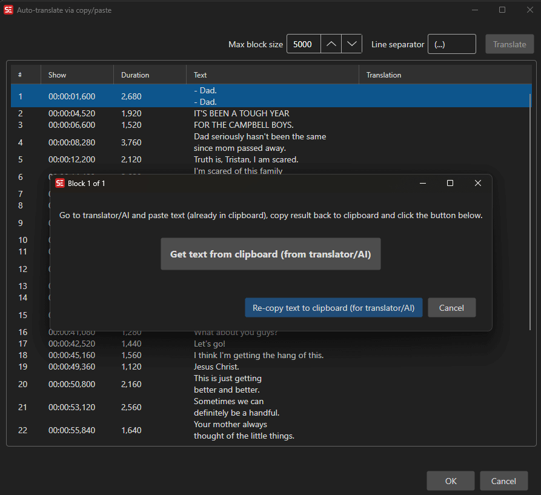

# Copy/Paste Translate

Translate subtitles by copying text blocks for translation in an external tool, then pasting back the results.

- **Menu:** Auto translate → Copy/paste translate...
- **Shortcut:** Configurable

<!-- Screenshot: Copy/paste translate window -->

## How to Use

1. Open **Auto translate → Copy/paste translate...**
2. Set the **Max block size** — maximum number of lines per block
3. Set the **Line separator** — character(s) separating lines in the copied text
4. Click **Copy** to copy the next block of subtitle text to the clipboard
5. Paste the text into your preferred translation tool (e.g., Google Translate, DeepL website)
6. Copy the translated text
7. Click **Paste** to paste the translated text back
8. Repeat for all blocks
9. Click **OK** to apply all translations

## Settings

- **Max block size** — Controls how many subtitle lines are copied at once (smaller blocks give more accurate translations)
- **Line separator** — The separator between lines in the clipboard text (default: `.`)

## Keyboard Shortcuts

| Key | Action |
|-----|--------|
| Escape | Close / Cancel |
